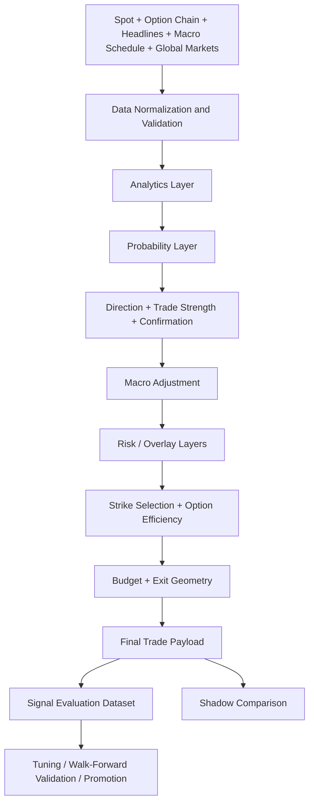
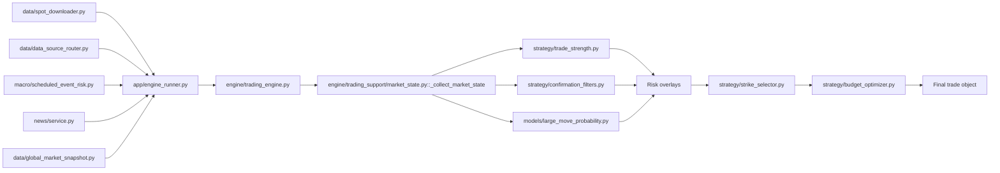
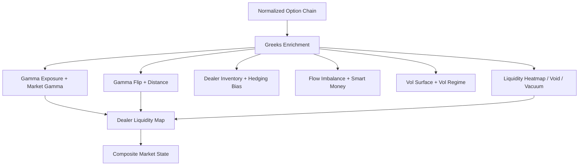
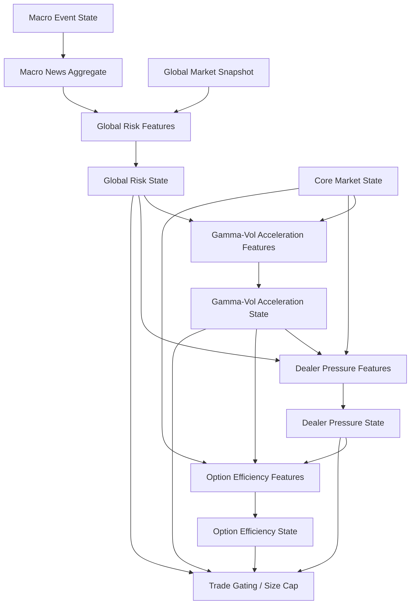
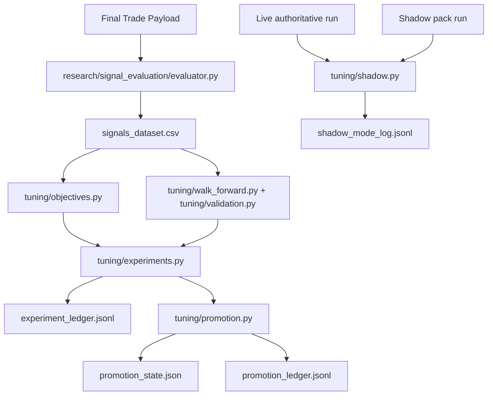
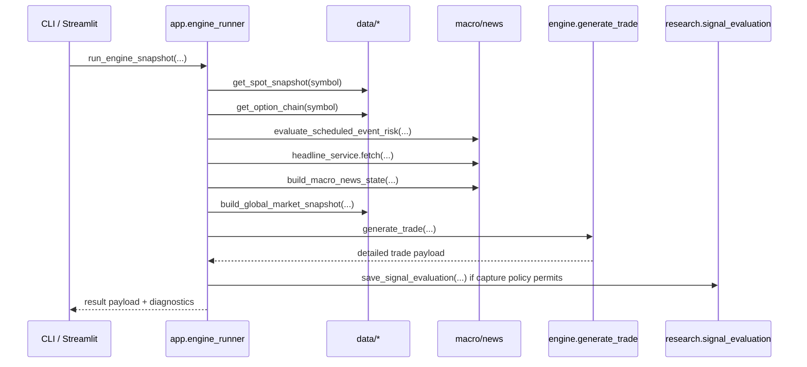
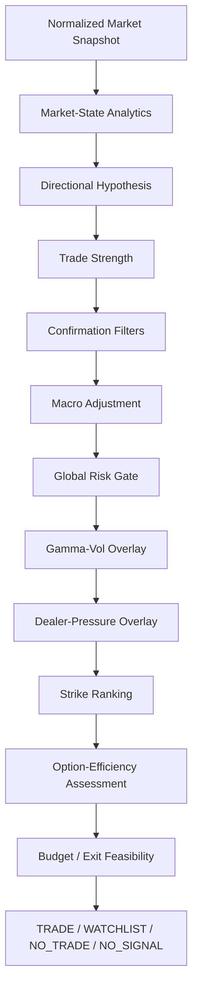
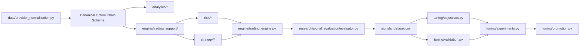

<div class="memo-cover">
<div class="cover-kicker">Technical System Monograph</div>
<h1 class="cover-title">Options Quant Engine</h1>
<div class="cover-subtitle">Comprehensive Codebase and Signal-Flow Documentation</div>
<div class="cover-rule"></div>
<p class="cover-summary">A code-grounded technical handbook documenting the complete system architecture, data flow, analytics, strategy logic, risk overlays, research instrumentation, tuning workflow, and governance mechanics implemented in the Options Quant Engine codebase.</p>
<div class="cover-meta">
<div><span>Author</span>Pramit Dutta</div>
<div><span>Organization</span>Quant Engines</div>
<div><span>Document</span>System Monograph</div>
<div><span>Date</span>March 2026</div>
<div><span>Scope</span>Architecture, modules, flow charts, assumptions, and technical debt</div>
<div><span>Audience</span>Quantitative researchers, systematic engineers, and derivatives practitioners</div>
</div>
</div>

## Abstract

This document provides a code-grounded technical handbook for the `options_quant_engine` repository. The focus is not a conceptual pitch or a README-level introduction, but an operational explanation of how the implemented system ingests market data, constructs analytics, infers market structure, forms trading signals, evaluates those signals against realized market outcomes, and uses the resulting research dataset for parameter governance, validation, and promotion workflows.

The system is best understood as a layered options-market inference architecture. It is not a broker execution stack, and it is not a single predictive model. Instead, it combines deterministic option-chain analytics, heuristic probability models, macro and headline conditioning, multiple overlay risk layers, strike-selection logic, research instrumentation, and a governance-oriented tuning framework. The codebase emphasizes interpretability, explicit fallbacks, reproducible research flows, and conservative production controls such as shadow mode and promotion ledgers.

The document is organized as a system monograph. It begins with the global architecture and end-to-end signal flow, then documents each major package, explains the mathematics and heuristics embedded in the implementation, traces how the final trade decision is formed, and concludes with assumptions, approximations, technical debt, and refactoring suggestions.

## Table of Contents

- [1. System Overview](#1-system-overview)
- [2. High-Level Architecture](#2-high-level-architecture)
- [3. End-to-End Signal Flow](#3-end-to-end-signal-flow)
  - [3.3 End-to-end pseudo-code](#33-end-to-end-pseudo-code)
- [4. Module-by-Module Documentation](#4-module-by-module-documentation)
  - [4.1 analytics](#41-analytics)
  - [4.2 engine](#42-engine)
  - [4.3 strategy](#43-strategy)
  - [4.4 risk](#44-risk)
  - [4.5 data](#45-data)
  - [4.6 models](#46-models)
  - [4.7 research](#47-research)
  - [4.8 tuning](#48-tuning)
  - [4.9 backtest](#49-backtest)
  - [4.10 app / interface / output layer](#410-app--interface--output-layer)
  - [4.11 config](#411-config)
  - [4.12 utilities / helpers](#412-utilities--helpers)
- [5. Mathematical and Logical Foundations by Module](#5-mathematical-and-logical-foundations-by-module)
- [6. End-to-End Trading Signal Construction](#6-end-to-end-trading-signal-construction)
  - [6.11 How the final trading signal is produced](#611-how-the-final-trading-signal-is-produced)
  - [6.12 Critical dependencies and coupling points](#612-critical-dependencies-and-coupling-points)
- [7. Flow Charts and Layer Connections](#7-flow-charts-and-layer-connections)
  - [7.6 Function-level live inference sequence](#76-function-level-live-inference-sequence)
  - [7.7 Final signal formation funnel](#77-final-signal-formation-funnel)
  - [7.8 Coupling and dependency map](#78-coupling-and-dependency-map)
- [8. Assumptions and Approximations](#8-assumptions-and-approximations)
- [9. Limitations / Technical Debt / Unclear Areas](#9-limitations--technical-debt--unclear-areas)
- [10. Future Refactoring / Enhancement Suggestions](#10-future-refactoring--enhancement-suggestions)

## 1. System Overview

At a system level, `options_quant_engine` is a structured signal-generation and research-governance platform for options trading. Its implemented boundary is:

1. ingest spot, option-chain, macro, headline, and cross-asset data,
2. normalize and validate that data,
3. compute option microstructure and dealer-structure analytics,
4. blend those analytics into a directional and structural trade hypothesis,
5. apply macro, global-risk, convexity, dealer-pressure, and option-efficiency overlays,
6. construct an actionable or non-actionable trade object,
7. capture the signal into a canonical evaluation dataset,
8. evaluate realized market outcomes against the signal,
9. tune and validate parameter packs offline,
10. govern candidate-to-live transitions through promotion and shadow workflows.

Several properties are important:

- The system is signal-evaluation-first. Research and tuning are based on how generated signals compare with subsequent market behavior, not on the user's manually executed trades.
- The live path is not an order-routing engine. The repository stops at signal generation, capture, evaluation, and governance.
- The architecture is intentionally layered. Core directional inference is separated from macro conditioning, global-risk gating, convexity overlays, dealer-pressure overlays, and option-efficiency overlays.
- Much of the logic is heuristic rather than model-estimated from proprietary flow data. The code frequently makes explicit proxy choices and conservative fallbacks.

The highest-level public runtime entrypoints are:

- `main.py`: CLI shell for live/replay operation.
- `app/streamlit_app.py`: interactive workstation.
- `app/engine_runner.py`: shared orchestration layer for both CLI and Streamlit, now split between a loader wrapper and a preloaded-snapshot execution path.
- `engine/signal_engine.py::generate_trade(...)`: canonical trade-generation function, with `engine/trading_engine.py` retained as a backward-compatible facade.

The repository also contains:

- a research dataset writer and outcome evaluator under `research/signal_evaluation/`,
- a tuning and validation framework under `tuning/`,
- replay and scenario harnesses under `backtest/`,
- policy/configuration surfaces under `config/`.

## 2. High-Level Architecture

The codebase is architected as cooperating layers rather than one monolithic model.

### 2.1 Architectural layers

- `data/`: provider adapters, replay loading, normalization, validation, spot and global-market snapshots.
- `analytics/`: option-chain-derived microstructure analytics, Greeks enrichment, gamma inference, liquidity and volatility heuristics.
- `models/`: move-probability logic and ML-adjacent abstractions.
- `strategy/`: trade-strength scoring, confirmation gating, strike ranking, budget sizing, exit geometry.
- `macro/` and `news/`: scheduled-event evaluation, headline ingestion/classification, macro-news aggregation, engine-level macro adjustments.
- `risk/`: overlay layers for global risk, gamma-vol acceleration, dealer hedging pressure, and option efficiency.
- `engine/`: orchestration of analytics, scoring, overlays, and payload construction.
- `research/`: canonical signal dataset, realized-outcome enrichment, research reporting.
- `tuning/`: parameter registry, packs, experiments, walk-forward validation, promotion, shadow-mode audit.
- `backtest/`: historical replay, synthetic option-chain backtests, scenario runners.
- `app/`: shared runner and Streamlit UI.

### 2.2 Design style

The design style is hybrid:

- deterministic analytics for option structure,
- parameterized heuristics for regime detection and trade scoring,
- optional ML probability input as one component rather than a full black-box controller,
- pluggable predictor architecture (`engine/predictors/`) allowing runtime selection between blended, pure-ML, pure-rule, research dual-model, and research decision-policy prediction methods,
- explicit dataclass-based state objects for overlay layers,
- research governance built around datasets and ledgers rather than ad hoc notebook tuning.

### 2.3 Runtime authority boundary

The runtime authority hierarchy is:

1. `app/engine_runner.py` acquires data and shared state.
2. `app/engine_runner.py::run_preloaded_engine_snapshot(...)` builds the shared snapshot context used by live, replay, and main backtest paths once market data is in memory.
3. `engine/signal_engine.py` generates the authoritative trade payload.
4. `research/signal_evaluation/` may capture that payload for later evaluation.
5. `tuning/shadow.py` may compare a non-authoritative candidate pack in parallel.
6. No module in the current codebase routes orders to a broker.

## 3. End-to-End Signal Flow

An authoritative live or replay run follows the same broad sequence.

### 3.1 Execution sequence

1. A caller invokes `app.engine_runner.run_engine_snapshot(...)`, or a historical path invokes `run_preloaded_engine_snapshot(...)` after loading market inputs.
2. `run_engine_snapshot(...)` loads the raw spot snapshot and option chain for live or replay mode.
3. The shared snapshot-context stage prepares:
   - spot snapshot from `data/spot_downloader.py`,
   - option chain from `data/data_source_router.py` or historical loaders,
   - scheduled event state from `macro/scheduled_event_risk.py`,
   - headlines from `news/service.py`,
   - global market snapshot from `data/global_market_snapshot.py`, or a neutral historical fallback when point-in-time cross-asset context is unavailable.
4. The runner normalizes expiry choice and validates the chain via `data/option_chain_validation.py`.
5. The runner builds:
   - `macro_news_state` via `macro/macro_news_aggregator.py`,
   - `global_risk_state` via `risk/global_risk_layer.py`.
6. The runner calls `engine.signal_engine.generate_trade(...)`.
7. The signal engine:
   - normalizes the option chain,
   - computes analytics via `engine/trading_support/` subpackage (market state, probability, signal state, trade modifiers),
   - computes probability state,
   - decides direction,
   - computes trade strength and confirmation,
   - applies macro and risk overlays,
   - ranks/selects strikes,
   - applies budget logic,
   - returns a final payload with explicit `execution_trade` and `trade_audit` subviews while preserving the legacy merged trade payload.
8. The runner optionally:
   - saves replay snapshots,
   - captures the signal into the evaluation dataset,
   - runs a shadow pack in parallel and logs the comparison.

### 3.2 Result object structure

The returned payload from `run_engine_snapshot(...)` is not just a final trade. It also contains:

- raw spot snapshot and validation,
- macro event state,
- headline ingestion state,
- macro-news aggregate state,
- global market snapshot,
- global risk state,
- option-chain validation and preview,
- final trade object,
- execution-facing trade view,
- research/audit trade view,
- trader-view rows,
- ranked strike candidates,
- shadow comparison data if enabled,
- signal capture status.

This makes the runtime payload both an operational decision object and a research capture object.

### 3.3 End-to-end pseudo-code

At a conceptual level, the authoritative runtime path can be summarized as:

```text
spot_snapshot          <- load or synthesize spot snapshot
option_chain_raw       <- load option chain
snapshot_context       <- prepare shared runtime context
                           (expiry resolution, validation, event state,
                            headline state, global-market state)

macro_news_state       <- build_macro_news_state(event_state, headline_state, as_of)
global_risk_state      <- build_global_risk_state(
                            macro_event_state,
                            macro_news_state,
                            global_market_snapshot,
                            holding_profile,
                            as_of,
                         )

trade <- generate_trade(
            symbol,
            spot,
            option_chain,
            previous_chain,
            spot_validation,
            option_chain_validation,
            macro_event_state,
            macro_news_state,
            global_risk_state,
            valuation_time,
         )

execution_trade, trade_audit <- split_trade_payload(trade)

if shadow_pack is active:
    shadow_trade <- rerun the same path with temporary_parameter_pack(shadow_pack)
    log side-by-side disagreement summary

if capture policy says capture:
    save_signal_evaluation(result_payload)
```

This pseudo-code makes clear that the system is architecturally closer to an inference-and-governance stack than to a monolithic trading bot. The runner constructs context, the engine constructs the trade object, and the research layer evaluates what the engine said relative to what the market later did.

## 4. Module-by-Module Documentation

## 4.1 analytics

### Responsibility

The `analytics/` package converts an option-chain snapshot into interpretable structural descriptors: gamma exposure, flip levels, dealer-positioning proxies, liquidity maps, flow imbalance, volatility state, and related measures.

### Package note

- `analytics/__init__.py` is empty and serves only as a package marker.

### File inventory and roles

#### `analytics/greeks_engine.py`

Primary responsibility:
- compute Black-Scholes-style option Greeks and enrich chain rows.

Key functions:
- `compute_option_greeks(...)`
- `enrich_chain_with_greeks(...)`
- `summarize_greek_exposures(...)`

Logic:
- parses expiry to time-to-expiry,
- computes `d1`, `d2`,
- derives `DELTA`, `GAMMA`, `THETA`, `VEGA`, `RHO`, plus `VANNA` and `CHARM`,
- aggregates chain-level exposures.

Connection:
- downstream analytics and trade scoring consume these Greeks if the provider did not supply them directly.

Approximation:
- Black-Scholes assumptions are used operationally, not as a full market model.

Function-level notes:
- `compute_option_greeks(...)` is the atomic formula engine. It is where option-type branching, time-to-expiry coercion, and sensitivity calculations occur.
- `enrich_chain_with_greeks(...)` is the dataframe-facing wrapper. It iterates rows, calls the scalar Greek calculator, and writes canonical Greek columns back into the chain.
- `summarize_greek_exposures(...)` is the aggregation layer. It collapses enriched row data into chain-level exposure summaries and qualitative regime labels.

Useful formulas:

\[
\Delta V \approx \Delta \, \Delta S + \frac{1}{2}\Gamma (\Delta S)^2 + \Theta \, \Delta t + \text{Vega} \, \Delta \sigma
\]

The code does not explicitly optimize over this local expansion, but many later heuristics implicitly reason from it. For example, gamma-heavy structures matter because local convexity grows with \((\Delta S)^2\), while option-efficiency logic cares whether the expected \(\Delta S\) is large enough to justify the premium paid.

#### `analytics/gamma_exposure.py`

Primary responsibility:
- estimate chain-level gamma exposure and label a gross gamma regime.

Key functions:
- `approximate_gamma(...)`
- `calculate_gamma_exposure(...)`
- `gamma_signal(...)`
- `calculate_gex(...)`

Logic:
- if actual `GAMMA` exists, uses `GAMMA * OI` with put/call sign handling,
- otherwise falls back to an inverse-distance proxy centered at spot,
- sums exposure to produce net gamma sign,
- labels long-gamma vs short-gamma.

Connection:
- feeds core market-state construction.

Approximation:
- the fallback proxy is intentionally crude.

Operational interpretation:
- `calculate_gamma_exposure(...)` should be read as a normalization bridge. It tries to respect provider-supplied `GAMMA` where possible; otherwise it uses a synthetic curvature proxy so the rest of the engine does not collapse.
- `gamma_signal(...)` is a regime classifier, not a numeric forecaster. Its output is consumed downstream by the engine as a categorical state variable.

#### `analytics/gamma_flip.py`

Primary responsibility:
- estimate the price level where aggregate gamma changes sign.

Key functions:
- `gamma_flip_level(...)`
- `gamma_flip_distance(...)`
- `gamma_regime(...)`

Logic:
- uses front-expiry, near-ATM slices,
- aggregates strike-wise signed gamma exposure,
- detects zero crossing,
- linearly interpolates the flip between adjacent strikes.

Connection:
- `spot_vs_flip`, `gamma_flip_distance_pct`, and `gamma_regime` become major inputs to direction, overlays, and strike ranking.

Pseudo-code:

```text
aggregate signed gamma exposure by strike
sort by strike
find adjacent strikes where exposure changes sign
if found:
    interpolate zero crossing
else:
    return None
```

This is structurally important because the engine repeatedly asks whether spot is above or below a structural hedging boundary and how far away that boundary is. That is materially different from simply asking whether price is above or below a moving average.

#### `analytics/market_gamma_map.py`

Primary responsibility:
- compute a more notionalized market gamma map and largest gamma clusters.

Key functions:
- `calculate_market_gamma(...)`
- `market_gamma_regime(...)`
- `largest_gamma_strikes(...)`

Logic:
- strike-level gamma exposure uses `gamma * oi * strike * signed_direction`,
- returns both total regime and dominant strikes.

Connection:
- clusters are later used for structure, strike ranking, and convexity overlays.

#### `analytics/dealer_inventory.py`

Primary responsibility:
- infer dealer positioning bias from OI and OI-change asymmetry.

Key functions:
- `dealer_inventory_metrics(...)`
- `dealer_inventory_position(...)`

Logic:
- compares call vs put open-interest changes,
- derives call/put OI change sums and bias,
- if changes are unavailable, falls back to static OI.

Connection:
- contributes `dealer_position` and inventory basis metadata used by engine and overlays.

#### `analytics/dealer_hedging_flow.py`

Primary responsibility:
- estimate immediate dealer hedge flow direction from chain delta inventory.

Key function:
- `dealer_hedging_flow(...)`

Logic:
- sums `delta * open_interest`,
- maps sign to a coarse futures-hedging direction.

Limit:
- this is a simplified sign proxy, not a flow model with path dynamics.

#### `analytics/dealer_hedging_simulator.py`

Primary responsibility:
- simulate hedge adjustments after a hypothetical price move.

Key functions:
- `simulate_dealer_hedging(...)`
- `hedging_bias(...)`

Logic:
- estimates delta change under an up/down move using gross gamma sensitivity,
- compares hedge response under the two scenarios,
- classifies outcomes such as pinning, upside acceleration, downside acceleration.

Connection:
- `dealer_hedging_bias` becomes a major directional and overlay input.

Pseudo-code:

```text
net_delta        <- sum(delta_i * OI_i)
gross_gamma      <- sum(abs(gamma_i) * OI_i)
hedge_if_up      <- net_delta + gross_gamma * price_move
hedge_if_down    <- net_delta - gross_gamma * price_move
classify bias from asymmetry between hedge_if_up and hedge_if_down
```

This is not a complete market-making model. It is a local stress test intended to answer: if spot moves from here, does hedge demand likely add fuel or absorb it?

#### `analytics/dealer_gamma_path.py`

Primary responsibility:
- simulate how aggregate gamma evolves over a price grid.

Key functions:
- `simulate_gamma_path(...)`
- `detect_gamma_squeeze(...)`

Logic:
- recomputes local aggregate gamma over hypothetical spot points,
- identifies steep slope regions,
- outputs a squeeze indicator when gamma changes rapidly with price.

Use:
- contributes a nonlinear convexity proxy rather than a direct directional signal.

#### `analytics/dealer_liquidity_map.py`

Primary responsibility:
- synthesize support/resistance, squeeze zones, vacuum bands, and projected structural move band.

Key functions:
- `nearest_support_resistance(...)`
- `estimate_squeeze_zone(...)`
- `summarize_vacuum(...)`
- `predict_large_move_band(...)`
- `build_dealer_liquidity_map(...)`

Logic:
- combines walls, gamma clusters, and vacuum zones into a structural map,
- predicts broad move bands from structure rather than price action alone.

Connection:
- used in trade strength, strike selection, and overlays.

The internal helper breakdown matters:
- `nearest_support_resistance(...)` translates raw level lists into the levels operationally closest to spot.
- `estimate_squeeze_zone(...)` combines flip and cluster context into a bounded price region.
- `predict_large_move_band(...)` is a coarse structural band projection used as a move-context input rather than a literal target.

#### `analytics/liquidity_heatmap.py`

Primary responsibility:
- locate highest-OI liquidity concentrations.

Key functions:
- `build_liquidity_heatmap(...)`
- `strongest_liquidity_levels(...)`
- `liquidity_signal(...)`

Logic:
- aggregates OI by strike and returns top liquidity levels.

#### `analytics/liquidity_void.py`

Primary responsibility:
- detect low absolute OI regions.

Key functions:
- `detect_liquidity_voids(...)`
- `nearest_liquidity_void(...)`
- `liquidity_void_signal(...)`

Logic:
- threshold-based on open interest.

Approximation:
- uses a fixed threshold, so symbol-specific depth effects are simplified.

This file is a good example of a deliberate heuristic compromise: the system would ideally normalize OI thresholds by symbol, expiry, and prevailing liquidity, but the present implementation chooses deterministic simplicity.

#### `analytics/liquidity_vacuum.py`

Primary responsibility:
- detect gap-like discontinuities between neighboring strike liquidity levels.

Key functions:
- `detect_liquidity_vacuum(...)`
- `vacuum_direction(...)`

Logic:
- uses OI gaps between adjacent strikes,
- flags regions where the next strike has much lower OI than the current strike.

Connection:
- feeds convexity and dealer-pressure overlays.

#### `analytics/options_flow_imbalance.py`

Primary responsibility:
- estimate directional options flow imbalance.

Key functions:
- `calculate_flow_imbalance(...)`
- `flow_signal(...)`

Logic:
- front-expiry near-ATM call-vs-put notional imbalance.

Connection:
- becomes one of the strongest direction votes.

#### `analytics/smart_money_flow.py`

Primary responsibility:
- estimate informed/unusual options flow.

Key functions:
- `detect_unusual_volume(...)`
- `classify_flow(...)`
- `smart_money_signal(...)`

Logic:
- combines volume/OI, OI change, and notional flow heuristics to classify bullish, bearish, or mixed flow.

#### `analytics/volatility_surface.py`

Primary responsibility:
- derive ATM IV and a basic volatility regime.

Key functions:
- `build_vol_surface(...)`
- `atm_vol(...)`
- `vol_regime(...)`

Logic:
- creates a simple strike/expiry IV surface summary,
- classifies low/normal/high IV.

#### `analytics/volatility_regime.py`

Primary responsibility:
- infer realized-volatility regime heuristically.

Key functions:
- `compute_realized_volatility(...)`
- `detect_volatility_regime(...)`
- `volatility_signal(...)`

Important note:
- this module uses option-price variability rather than a full spot return process and is therefore a relatively rough heuristic.

#### `analytics/intraday_gamma_shift.py`

Primary responsibility:
- compare previous and current chain gamma profiles.

Key functions:
- `compute_gamma_profile(...)`
- `detect_gamma_shift(...)`
- `gamma_shift_signal(...)`

Logic:
- detects whether gamma structure is increasing or decreasing intraday.

#### `analytics/flow_utils.py`

Primary responsibility:
- helper utilities for front-expiry ATM slicing.

Key functions:
- `infer_strike_step(...)`
- `front_expiry_atm_slice(...)`

Role:
- widely used to make analytics focus on the most relevant expiry and spot neighborhood.

#### `analytics/gamma_walls.py`

Primary responsibility:
- older/simple wall classification helper.

Key functions:
- `detect_gamma_walls(...)`
- `classify_walls(...)`

Note:
- this file uses legacy column names such as `STRIKE_PR` and `OPEN_INT`.
- It appears to be an older heuristic helper, partially superseded by richer structure modules and provider normalization, but still conceptually aligned with support/resistance inference.

That distinction matters for maintainers. `gamma_walls.py` is not obviously dead code, but it is not the most canonical representation of current structure logic either.

### Output flow from analytics

Outputs from `analytics/` feed directly into:

- `engine/trading_support/market_state.py::_collect_market_state(...)`
- `strategy/trade_strength.py`
- `strategy/confirmation_filters.py`
- overlay feature builders in `risk/`

A useful mental model is:

\[
\text{Option chain} \rightarrow \text{Greeks / structure / flow summaries} \rightarrow \text{market state dictionary}
\]

The analytics layer itself does not decide whether to trade. It creates the vocabulary used by the engine and overlay layers to express a trade hypothesis.

## 4.2 engine

### Responsibility

The `engine/` package is the system’s central orchestrator. It does not fetch raw market data itself; instead it accepts normalized inputs and transforms them into a final signal/trade payload.

### File inventory and roles

#### `engine/trading_engine.py`

Primary responsibility:
- define `generate_trade(...)`, the main trade-construction entrypoint.

Core stages inside `generate_trade(...)`:

1. normalize the chain,
2. compute market-state analytics,
3. compute probability state,
4. derive direction,
5. derive trade strength and confirmation,
6. apply macro-news adjustment,
7. build and evaluate global risk state,
8. build gamma-vol acceleration state and apply modifiers,
9. build dealer-pressure state and apply modifiers,
10. rank strikes, including option-efficiency candidate hook,
11. build full option-efficiency state for selected contract,
12. apply budget and size constraints,
13. classify signal quality, regime, execution regime,
14. assemble comprehensive payload.

The function returns much more than:
- direction,
- strike,
- option type,
- trade status,
- trade strength,

It also carries:
- analytics diagnostics,
- overlay states,
- score breakdowns,
- ranked strike candidates,
- budget information,
- validation summaries,
- capture-friendly metadata for research.

Function-level interpretation:
- `generate_trade(...)` is not only a trade builder but also the canonical merger of base signal logic and overlays.
- The function’s hidden complexity lies less in arithmetic and more in sequencing: certain layers must be built early because they affect whether later work is meaningful. For example, global risk may downgrade or block a candidate before a contract should be seriously considered.

High-level pseudo-code:

```text
df                  <- normalize_option_chain(option_chain)
market_state        <- _collect_market_state(df, spot, symbol, previous_chain)
probability_state   <- _compute_probability_state(market_state)
signal_state        <- _compute_signal_state(market_state, probability_state)
macro_adjustments   <- compute_macro_news_adjustments(direction, macro_news_state)
global_eval         <- evaluate_global_risk_layer(...)
gamma_vol_state     <- build_gamma_vol_acceleration_state(...)
dealer_pressure     <- build_dealer_hedging_pressure_state(...)
ranked_candidates   <- rank_strike_candidates(..., candidate_hook=option_efficiency_hook)
selected_contract   <- choose best ranked candidate
option_efficiency   <- build_option_efficiency_state(selected_contract, ...)
lot_plan            <- optimize_lots(...)
final_payload       <- assemble everything into trade object
```

What the file controls:
- exact order of subsystem invocation,
- how score adjustments accumulate,
- what gets surfaced to UI/research payloads,
- which statuses are treated as actionable.

#### `engine/trading_support/` (facade: `engine/trading_engine_support.py`)

The support layer has been refactored into a subpackage under `engine/trading_support/` with distinct modules for market state, probability, signal state, trade modifiers, and common utilities. The facade `engine/trading_engine_support.py` re-exports all public names for backward compatibility.

High-value functions:
- `normalize_option_chain(...)`
- `_collect_market_state(...)`
- `_compute_probability_state(...)`
- `_compute_signal_state(...)`
- `_compute_data_quality(...)`
- `decide_direction(...)`
- `classify_signal_quality(...)`
- `classify_signal_regime(...)`
- `classify_execution_regime(...)`
- `derive_global_risk_trade_modifiers(...)`
- `derive_gamma_vol_trade_modifiers(...)`
- `derive_dealer_pressure_trade_modifiers(...)`
- `derive_option_efficiency_trade_modifiers(...)`

Important implementation pattern:
- `_call_first(...)` probes candidate function names from older/newer analytics modules to preserve compatibility across evolving helper APIs.

Market-state collection:
- `_collect_market_state(...)` is the main bridge from raw chain to analytical descriptors.
- It calls analytics modules, normalizes outputs to Python numbers/lists, computes derived quantities such as `gamma_flip_distance_pct`, `intraday_range_pct`, and `atm_iv_percentile`, and packages everything into a single dictionary.

Probability state:
- `_compute_probability_state(...)` dispatches through the pluggable predictor architecture:
  - checks for a runtime predictor override (set by `prediction_method_override` context manager or backtest `prediction_method` parameter),
  - falls back to the `PREDICTION_METHOD` config setting (env `OQE_PREDICTION_METHOD`, default `"blended"`),
  - if the method is `"blended"` (default), calls the production pipeline directly (zero overhead),
  - for any other method (`pure_ml`, `pure_rule`, `research_dual_model`, `research_decision_policy`, or custom), resolves the predictor from the singleton factory and calls `predictor.predict(market_ctx)`,
  - returns a dict containing `rule_move_probability`, `ml_move_probability`, `hybrid_move_probability`, `model_features`, and `components`.
- Available predictor methods:
  - `blended`: combines rule probability from `models/large_move_probability.py`, optional ML probability from `models/ml_move_predictor.py`, and a hybrid blend via `_blend_move_probability(...)`.
  - `pure_ml`: ML leg only — the rule leg is suppressed and `hybrid_move_probability` equals `ml_move_probability`.
  - `pure_rule`: rule leg only — the ML leg is suppressed and `hybrid_move_probability` equals `rule_move_probability`.
  - `research_dual_model`: runs the standard pipeline first, then overlays GBT ranking and LogReg calibration inference from `research/ml_models/`, using the calibrated confidence as `hybrid_move_probability`.
  - `research_decision_policy`: extends `research_dual_model` with a decision-policy layer (`research/decision_policy/`). Applies the dual-threshold policy to produce ALLOW / BLOCK / DOWNGRADE decisions — BLOCKed signals are clamped to 0.0 probability; DOWNGRADEd signals are halved. Components carry `policy_decision`, `policy_reason`, and `policy_size_multiplier`.
- All predictors implement the `MovePredictor` Protocol defined in `engine/predictors/protocol.py` and are registered in the factory at `engine/predictors/factory.py`.
- Custom predictors can be added at runtime via `register_predictor(name, cls)`.

Direction decision:
- `decide_direction(...)` is a weighted-vote mechanism rather than a single classifier.
- Votes include flow, smart money, hedging bias, gamma squeeze, spot-vs-flip, dealer-vol interaction, vanna, charm, and optional backtest-derived cues.

Data quality:
- `_compute_data_quality(...)` merges spot-validation health, option-chain-validation health, and analytics/probability completeness into a `data_quality_score`.

Additional function-level notes:
- `normalize_option_chain(...)` is a crucial bridge, because many analytics assume canonical numeric columns and clean option-type labels.
- `_collect_market_state(...)` is effectively the system’s state-estimation phase.
- `_compute_probability_state(...)` is the prediction adjunct, but only one part of the later decision.
- `_compute_signal_state(...)` ties together direction, score, confirmation, and quality.
- the `derive_*_trade_modifiers(...)` functions are important because they codify the philosophy that overlays should modify or filter, not independently generate the core trade.

One practical coupling point:
- because `_collect_market_state(...)` produces a large denormalized dictionary, many downstream modules depend on stable field naming rather than narrow interfaces. This is convenient but creates coupling risk if field names change.

#### `engine/runtime_metadata.py`

Primary responsibility:
- define trader-facing field lists and default empty structures.

Functions:
- `empty_scoring_breakdown()`
- `empty_confirmation_state()`

Role:
- UI and CLI output formatting.

#### `engine/__init__.py`

- package marker, minimal.

### Engine assumptions

- The engine assumes the caller has already provided or fetched the correct market snapshot.
- The engine treats overlays as modifiers and filters rather than replacing the base directional hypothesis.
- Missing data generally downgrades confidence and pushes toward neutral/watchlist/block decisions rather than fabricating strong signals.

## 4.3 strategy

### Responsibility

The `strategy/` package converts structural analytics into tradable expression: score, confirmation, strike, size, and exit geometry.

### File inventory and roles

#### `strategy/trade_strength.py`

Primary responsibility:
- compute the scalar `trade_strength`.

Key function:
- `compute_trade_strength(...)`

Logic:
- additive score from multiple directional and structural components:
  - flow signal,
  - smart money flow,
  - gamma event/squeeze,
  - dealer gamma state,
  - vol regime,
  - liquidity void/vacuum,
  - spot relative to gamma flip,
  - hedging bias,
  - gamma regime,
  - intraday gamma shift,
  - wall proximity,
  - dealer liquidity map,
  - large-move probability,
  - directional consensus.

Important property:
- this is a score aggregator, not a calibrated expected-return estimator.

Pseudo-code:

```text
score = 0
score += flow contribution
score += smart-money contribution
score += gamma regime contribution
score += hedging contribution
score += liquidity/vacuum contribution
score += wall-proximity contribution
score += large-move probability contribution
score += directional-consensus contribution
```

The internal helpers such as `_flow_score(...)`, `_hedging_bias_score(...)`, `_wall_proximity_score(...)`, and `_probability_bucket_score(...)` matter because they standardize heterogeneous inputs onto a comparable bounded scoring scale before aggregation.

#### `strategy/confirmation_filters.py`

Primary responsibility:
- compute directional confirmation and veto state.

Key function:
- `compute_confirmation_filters(...)`

Logic:
- tests whether the proposed direction is supported by:
  - open-vs-spot alignment,
  - previous close,
  - range expansion,
  - flow alignment,
  - hedging alignment,
  - gamma squeeze alignment,
  - move-probability support,
  - spot-vs-flip consistency.

Output:
- a confirmation score/state used downstream by the engine and global risk gating.

This file is best understood as a veto layer. Trade strength asks “how much aligned structure exists?” Confirmation asks “does the present market context contradict the trade strongly enough that we should distrust the raw score?”

#### `strategy/strike_selector.py`

Primary responsibility:
- rank and select candidate options once direction is known.

Key functions:
- `rank_strike_candidates(...)`
- `select_best_strike(...)`

Scoring dimensions:
- moneyness,
- directional side consistency,
- premium affordability,
- liquidity,
- support/resistance wall distance,
- gamma-cluster distance,
- IV desirability.

Extension hook:
- `candidate_score_hook` enables overlay-aware re-ranking. The option-efficiency layer uses this.

Function-level interpretation:
- `rank_strike_candidates(...)` constructs a scored dataframe-like candidate set rather than directly returning only one strike.
- `select_best_strike(...)` is a thin chooser over ranked results.
- `_build_candidate_record(...)` is the important synthesis point that merges structural scores with raw contract fields.

Strike-score abstraction:

\[
\text{strike score}
= s_{\text{moneyness}}
+ s_{\text{direction}}
+ s_{\text{premium}}
+ s_{\text{liquidity}}
+ s_{\text{wall}}
+ s_{\gamma\text{-cluster}}
+ s_{\text{IV}}
+ s_{\text{hook}}
\]

#### `strategy/budget_optimizer.py`

Primary responsibility:
- compute feasible lot count under capital constraints.

Key function:
- `optimize_lots(...)`

Logic:
- simple premium-cost and capital-cap math.

#### `strategy/exit_model.py`

Primary responsibility:
- create target and stop-loss geometry.

Key function:
- `calculate_exit(...)`

Logic:
- fixed percentage multipliers from config settings or backtest overrides.

Approximation:
- this is a lightweight exit-construction model, not a dynamic optimal stopping routine.

In practice:

\[
\text{target} = \text{entry price} \times (1 + \tau), \qquad
\text{stop} = \text{entry price} \times (1 - \lambda)
\]

with \(\tau\) and \(\lambda\) drawn from settings or backtest overrides.

## 4.4 risk

### Responsibility

The `risk/` package contains modular overlay layers that refine or constrain the base signal.

### Architectural pattern

Each overlay typically has:

- `*_features.py`: raw feature construction,
- `*_regime.py`: state classification and adjustment logic,
- `*_models.py`: dataclass schema,
- `*_layer.py`: public builder/facade.

### Global risk

#### `risk/global_risk_features.py`

Responsibility:
- convert macro event state, macro-news state, and global market snapshot into interpretable cross-asset risk features.

Features include:
- `oil_shock_score`
- `gold_risk_score`
- `copper_growth_signal`
- `commodity_risk_score`
- `volatility_shock_score`
- `us_equity_risk_score`
- `rates_shock_score`
- `currency_shock_score`
- `macro_event_risk_score`
- `risk_off_intensity`
- `volatility_compression_score`
- `volatility_explosion_probability`

Important implementation details:
- market-session context and holding-profile context are encoded,
- stale/unusable market snapshots are explicitly neutralized,
- raw snapshot values are preserved for diagnostics.

Function-level logic:
- `_market_session_context(...)` determines whether the signal is being formed during local session, after close, or into overnight context.
- `_market_snapshot_details(...)` and `_market_input_state(...)` separate raw inputs from their usability assessment.
- feature builders such as `_oil_shock_score(...)` and `_volatility_compression_score(...)` are intentionally explicit scalar transforms rather than latent factors.

#### `risk/global_risk_regime.py`

Responsibility:
- classify global risk regime and overnight risk.

Key outcomes:
- `global_risk_state`
- `global_risk_score`
- `overnight_gap_risk_score`
- `volatility_expansion_risk_score`
- `overnight_hold_allowed`
- `overnight_hold_reason`
- `overnight_risk_penalty`

States:
- `VOL_SHOCK`
- `EVENT_LOCKDOWN`
- `RISK_OFF`
- `RISK_ON`
- `GLOBAL_NEUTRAL`

The file also contains a legacy-state bridge through `_legacy_state(...)`, which is useful for backward diagnostics and highlights that the global-risk layer has evolved from a simpler warning taxonomy to a richer regime classifier.

#### `risk/global_risk_layer.py`

Responsibility:
- public construction and engine-facing evaluation.

Key functions:
- `build_global_risk_state(...)`
- `evaluate_global_risk_layer(...)`

Engine-facing behavior:
- may leave trade unchanged,
- reduce size,
- force watchlist,
- force `NO_TRADE`,
- block overnight hold.

This file is where abstract regime state becomes operational policy. In other words:

\[
\text{risk classification} \rightarrow \text{execution constraint}
\]

That conversion is deliberately explicit rather than emergent.

### Gamma-vol acceleration

#### `risk/gamma_vol_acceleration_features.py`

Responsibility:
- detect convexity-acceleration conditions.

Feature families:
- gamma regime base,
- flip proximity,
- volatility transition,
- liquidity vacuum,
- hedging bias alignment,
- intraday extension,
- macro/global boost.

Useful abstraction:

\[
\text{acceleration score}
= a_1 g_{\gamma}
+ a_2 g_{\text{flip}}
+ a_3 g_{\text{vol transition}}
+ a_4 g_{\text{vacuum}}
+ a_5 g_{\text{hedging}}
+ a_6 g_{\text{macro/global}}
\]

The code implements this through explicit bounded helper functions rather than matrix algebra, but the structure is equivalent.

#### `risk/gamma_vol_acceleration_regime.py`

Responsibility:
- classify:
  - `LOW_ACCELERATION_RISK`
  - `MODERATE_ACCELERATION_RISK`
  - `HIGH_ACCELERATION_RISK`
  - `EXTREME_ACCELERATION_RISK`
- and directional convexity states:
  - `UPSIDE_SQUEEZE_RISK`
  - `DOWNSIDE_AIRPOCKET_RISK`
  - `TWO_SIDED_VOLATILITY_RISK`
  - `NO_CONVEXITY_EDGE`

Outputs:
- `gamma_vol_acceleration_score`
- `upside_squeeze_risk`
- `downside_airpocket_risk`
- `overnight_convexity_risk`
- `gamma_vol_adjustment_score`

The distinction between raw score and adjustment score matters:
- raw score is descriptive,
- adjustment score is operational and intended to feed trade-strength modification.

#### `risk/gamma_vol_acceleration_layer.py`

Responsibility:
- public builder returning structured overlay state.

### Dealer hedging pressure

#### `risk/dealer_hedging_pressure_features.py`

Responsibility:
- estimate when dealer hedging flows are likely to reinforce moves or pin price.

Inputs:
- gamma regime,
- dealer position,
- spot vs flip,
- flip proximity,
- hedging bias,
- hedging flow,
- intraday gamma state,
- flow confirmation,
- structure concentration,
- macro/global stress,
- gamma-vol acceleration.

Outputs:
- `dealer_hedging_pressure_score`
- `upside_hedging_pressure`
- `downside_hedging_pressure`
- `pinning_pressure_score`
- `overnight_hedging_risk`

Pseudo-code:

```text
upside  <- gamma base + upside bias + upside flow confirmation + upside structure support
downside<- gamma base + downside bias + downside flow confirmation + downside structure support
pinning <- long-gamma / pinning bias / wall concentration / dense structure
boost all by macro/global stress only as modifier
```

#### `risk/dealer_hedging_pressure_regime.py`

Responsibility:
- classify:
  - `UPSIDE_HEDGING_ACCELERATION`
  - `DOWNSIDE_HEDGING_ACCELERATION`
  - `PINNING_DOMINANT`
  - `TWO_SIDED_INSTABILITY`
  - `HEDGING_NEUTRAL`

#### `risk/dealer_hedging_pressure_layer.py`

Responsibility:
- public state builder.

### Option efficiency

#### `risk/option_efficiency_features.py`

Responsibility:
- evaluate economic attractiveness of a specific option trade expression.

Core fields:
- `expected_move_points`
- `expected_move_pct`
- `expected_move_quality`
- `target_distance_points`
- `target_distance_pct`
- `expected_move_coverage_ratio`
- `premium_efficiency_score`
- `strike_moneyness_bucket`
- `payoff_efficiency_hint`

Important logic:
- expected move uses `spot * iv * sqrt(T)`,
- time-to-expiry can come from explicit `TTE` or expiry parsing,
- option delta is used to approximate underlying-distance vs option payoff relation.

Function-level interpretation:
- `_normalize_iv(...)` protects against percent-vs-decimal inconsistency.
- `_parse_time_to_expiry_years(...)` is a critical bridge because expiry handling is often messy in live provider data.
- `_effective_delta(...)` prevents raw delta edge cases from making payoff estimates numerically unstable.
- `_payoff_hint(...)` transforms contract geometry into a human-readable efficiency hint.

#### `risk/option_efficiency_layer.py`

Responsibility:
- score target reachability, premium efficiency, strike efficiency, overall option efficiency, and overnight penalty.

Key functions:
- `classify_option_efficiency_state(...)`
- `build_option_efficiency_state(...)`
- `score_option_efficiency_candidate(...)`

The candidate-scoring hook is especially important because it allows efficiency logic to shape strike ranking before a final contract is selected, while the full state builder refines the assessment once actual entry/target/stop fields are known.

### Models and exports

Dataclasses:
- `risk/global_risk_models.py`
- `risk/gamma_vol_acceleration_models.py`
- `risk/dealer_hedging_pressure_models.py`
- `risk/option_efficiency_models.py`

Exports:
- `risk/__init__.py` re-exports public layer builders.

## 4.5 data

### Responsibility

The `data/` package is responsible for provider access, schema normalization, spot and cross-asset ingestion, replay I/O, expiry resolution, and chain validation.

### File inventory and roles

#### `data/data_source_router.py`

Responsibility:
- select provider adapter and return normalized option chain.

Primary class:
- `DataSourceRouter`

Behavior:
- wraps NSE, Zerodha, and ICICI adapters,
- centralizes provider selection,
- supports closing provider resources.

#### `data/provider_normalization.py`

Responsibility:
- normalize provider-specific columns to the canonical schema expected by analytics and engine code.

This file is important because:
- many analytics assume column names like `strikePrice`, `openInterest`, `lastPrice`, `impliedVolatility`, `OPTION_TYP`, `EXPIRY_DT`.

#### `data/option_chain_validation.py`

Responsibility:
- assess whether an option chain is usable for live trading or replay analysis.

Checks include:
- missing canonical columns,
- CE/PE balance,
- priced-row availability,
- IV presence,
- strike pairing integrity,
- duplicate ratio,
- expiry count.

Output:
- validation dictionary used by the engine and runner.

#### `data/spot_downloader.py`

Responsibility:
- fetch and validate the current spot snapshot.

Functions:
- `get_spot_snapshot(...)`
- `validate_spot_snapshot(...)`
- `save_spot_snapshot(...)`

Logic:
- intraday and daily Yahoo data,
- lookback average range percentage,
- freshness and consistency validation.

Function-level distinction:
- `get_spot_snapshot(...)` is acquisition plus light normalization.
- `validate_spot_snapshot(...)` is policy-oriented and separates live-trading-valid vs replay-analysis-valid use cases.
- `save_spot_snapshot(...)` is operational tooling for replay and debugging.

#### `data/global_market_snapshot.py`

Responsibility:
- fetch global cross-asset inputs for the global-risk layer.

Instruments include:
- oil,
- gold,
- copper,
- VIX,
- S&P 500,
- Nasdaq,
- US 10Y,
- USDINR,
- proxy underlying history.

Fallback:
- returns a neutral snapshot when disabled, stale, empty, or failed.

#### `data/expiry_resolver.py`

Responsibility:
- normalize expiry strings and choose the selected expiry.

Functions:
- `normalize_expiry_value(...)`
- `ordered_expiries(...)`
- `resolve_selected_expiry(...)`
- `filter_option_chain_by_expiry(...)`

Role:
- front-expiry selection is a recurring assumption throughout the engine.

#### `data/replay_loader.py`

Responsibility:
- save/load replay artifacts.

Functions:
- `load_spot_snapshot(...)`
- `load_option_chain_snapshot(...)`
- `save_option_chain_snapshot(...)`
- `latest_replay_snapshot_paths(...)`

#### `data/historical_option_chain.py`

Responsibility:
- provide historical option-chain data for backtests.

Important detail:
- if no cached real chain exists, this module can build a synthetic historical chain from Yahoo spot history and simplified IV assumptions.

Implication:
- historical backtests may depend on approximated option surfaces rather than true archived chain states.

Pseudo-code:

```text
if cached historical option chain exists:
    load and validate
else:
    download spot history
    infer next expiry for each timestamp
    synthesize option prices via simplified BS pricing / IV fallback
    cache result
```

This file is therefore a research convenience layer, not a full institutional historical options database.

#### `data/historical_iv_surface.py`

Responsibility:
- load cached IV-surface data and retrieve approximate surface IV by timestamp/strike/type.

#### Provider adapters

##### `data/nse_option_chain_downloader.py`

Responsibility:
- NSE-specific fetch and parse logic.

Implementation character:
- request handling, expiry probing, response normalization, and dataframe construction.

##### `data/icici_breeze_option_chain.py`

Responsibility:
- ICICI Breeze-specific option-chain adapter class.

Implementation character:
- auth bootstrapping, request orchestration, provider-specific response parsing, cache/quality handling.

##### `data/zerodha_option_chain.py`

Responsibility:
- Zerodha-specific adapter.

Note:
- more adapter-oriented than analytical.

### Data flow downstream

Outputs from `data/` feed:

- `app/engine_runner.py`,
- research replay workflows,
- historical backtests,
- global risk cross-asset ingestion.

## 4.6 models

### Responsibility

The `models/` package contains probability and feature abstractions rather than the full trading engine.

The pluggable predictor architecture (`engine/predictors/`) sits above these models and controls which combination of rule/ML/research models produces the final probability output. The `models/` package provides the underlying implementations that predictors delegate to.

### File inventory and roles

#### `models/feature_builder.py`

Responsibility:
- build a compact numerical feature vector for move prediction.
- routes between 7-feature heuristic path and 33-feature ML path based on whether `ACTIVE_MODEL` is configured.

Inputs:
- gamma exposure,
- gamma flip,
- spot vs flip,
- IV,
- flow,
- liquidity,
- other normalized descriptors.

#### `models/large_move_probability.py`

Responsibility:
- heuristic rule-based estimate of large-move probability.

Function:
- `large_move_probability(...)`

Logic:
- bounded additive/refinement model based on gamma regime, vacuum state, flow, IV, and related analytics.

Role:
- a deterministic probability proxy used even when no ML model is available.
- provides the rule leg for `DefaultBlendedPredictor` and `PureRulePredictor`.

It is useful to read this model as:

\[
p_{\text{large move}} = \text{clip}\left(p_0 + \sum_i b_i x_i\right)
\]

where the \(x_i\) are structural categorical or continuous heuristics rather than statistically estimated latent variables.

#### `models/ml_move_predictor.py`

Responsibility:
- provide a live-friendly predictor wrapper.

Primary class:
- `MLMovePredictor`

Behavior:
- if an underlying model exists in the registry, delegates to it,
- otherwise uses heuristic fallback behavior to produce a stable probability estimate.
- provides the ML leg for `DefaultBlendedPredictor` and `PureMLPredictor`.

#### `models/move_predictor.py`

Responsibility:
- scikit-learn RandomForest wrapper for training/predicting move direction.

Important note:
- this appears research-oriented or optional.
- The live engine primarily uses `ml_move_predictor.py`; `move_predictor.py` is a more traditional training wrapper that may not be the default live path.

### Pluggable Predictor Architecture (`engine/predictors/`)

The predictor layer sits between the probability computation in `engine/trading_support/probability.py` and the underlying model implementations in `models/`. It provides a Protocol-based abstraction that allows the engine to swap between different prediction methods via configuration.

#### Protocol and data contract

`engine/predictors/protocol.py` defines:
- `MovePredictor` Protocol — requires a `name` property and `predict(market_ctx: dict) -> PredictionResult`.
- `PredictionResult` frozen dataclass — standardized output containing `rule_move_probability`, `ml_move_probability`, `hybrid_move_probability`, `model_features`, `components`, and `predictor_name`.

#### Factory resolution

`engine/predictors/factory.py` provides:
- `get_predictor()` — returns the active predictor singleton, resolved from `PREDICTION_METHOD` config.
- `reset_predictor()` — clears the singleton for testing or hot-swap.
- `register_predictor(name, cls)` — registers custom predictors at runtime.
- `prediction_method_override(method)` — context manager for temporary predictor swaps (used by backtester).

#### Built-in predictors

| Predictor | Source | Behavior |
|---|---|---|
| `DefaultBlendedPredictor` | `engine/predictors/builtin_predictors.py` | Current production pipeline: rule + ML + logistic-recalibration blend |
| `PureRulePredictor` | `engine/predictors/builtin_predictors.py` | Rule-based leg only, ML suppressed, `hybrid = rule_probability` |
| `PureMLPredictor` | `engine/predictors/builtin_predictors.py` | ML leg only, rule suppressed, `hybrid = ml_probability` |
| `ResearchDualModelPredictor` | `engine/predictors/research_predictor.py` | Runs standard pipeline, overlays GBT ranking + LogReg calibration, uses calibrated confidence as hybrid |
| `ResearchDecisionPolicyPredictor` | `engine/predictors/decision_policy_predictor.py` | Extends dual-model with decision-policy overlay (ALLOW/BLOCK/DOWNGRADE); BLOCKed → 0.0, DOWNGRADEd → halved |

## 4.7 research

### Responsibility

The `research/` package captures signals, evaluates them against realized outcomes, and provides report-generation surfaces for research and tuning.

### `research/signal_evaluation/`

#### `research/signal_evaluation/dataset.py`

Responsibility:
- define the canonical dataset schema and upsert behavior.

Key functions:
- `load_signals_dataset(...)`
- `write_signals_dataset(...)`
- `ensure_signals_dataset_exists(...)`
- `upsert_signal_rows(...)`

Important design:
- one signal corresponds to one row keyed by `signal_id`,
- later evaluation enriches the same row rather than creating duplicate records.

#### `research/signal_evaluation/evaluator.py`

Responsibility:
- construct signal rows and attach realized outcomes.

High-value functions:
- `build_signal_id(...)`
- `build_regime_fingerprint(...)`
- `build_signal_evaluation_row(...)`
- `compute_signal_evaluation_scores(...)`
- `evaluate_signal_outcomes(...)`
- `fetch_realized_spot_path(...)`
- `save_signal_evaluation(...)`
- `update_signal_dataset_outcomes(...)`

Implemented scores:
- direction score,
- magnitude score,
- timing score,
- tradeability score,
- composite signal score.

Outcome horizons:
- 5m, 15m, 30m, 60m,
- session close,
- next open,
- next close.

Additional path metrics:
- MFE/MAE,
- signed return in basis points,
- window highs/lows,
- calibration buckets,
- regime fingerprint metadata.

Function-level notes:
- `build_signal_evaluation_row(...)` extracts the canonical research row from a runtime payload.
- `compute_signal_evaluation_scores(...)` transforms realized outcomes into research scores.
- `evaluate_signal_outcomes(...)` is the realized-path enricher.
- `fetch_realized_spot_path(...)` is the external-data dependency for post-trade evaluation.

Score abstraction:

\[
\text{composite score}
= w_d \cdot \text{direction score}
+ w_m \cdot \text{magnitude score}
+ w_t \cdot \text{timing score}
+ w_{tr} \cdot \text{tradeability score}
\]

This is a central design choice: the research target is multi-dimensional and not reducible to a single realized return number.

#### `research/signal_evaluation/reports.py`

Responsibility:
- generate grouped research summaries.

Reports include:
- hit rate by trade strength,
- hit rate by macro regime,
- average score by signal quality,
- average realized return by horizon,
- signal count by regime,
- probability calibration,
- regime fingerprint performance.

#### `research/signal_evaluation/policy.py`

Responsibility:
- determine which signals should be captured.

Policies:
- `TRADE_ONLY`
- `ACTIONABLE`
- `ALL_SIGNALS`

#### `research/signal_evaluation/__init__.py`

Role:
- package exports.

### `research/parameter_tuning/`

Contains:
- README and runtime-generated ledgers/state files.

Important note:
- these artifacts represent governance state and experiment history rather than core trading logic.

### Other research sources

- `research/quant_note_trade_signal_logic.md`
- `research/quant_note_trade_signal_logic_style.css`

These are authored research-note/documentation assets, not runtime logic.

## 4.8 tuning

### Responsibility

The `tuning/` package is a research-governance subsystem for parameterized experimentation, validation, promotion, and shadow monitoring.

### File inventory and roles

#### `tuning/models.py`

Responsibility:
- define structured dataclasses for the tuning ecosystem.

Key dataclasses:
- `ParameterDefinition`
- `ParameterPack`
- `ObjectiveResult`
- `ExperimentResult`
- `TuningGroupPlan`
- `PromotionDecision`
- `WalkForwardSplit`
- `PackStateAssignment`
- `ManualApprovalRecord`
- `PromotionLedgerEvent`

#### `tuning/registry.py`

Responsibility:
- central parameter registry.

Key constructs:
- `ParameterRegistry`
- `build_default_parameter_registry()`
- `get_parameter_registry()`

Behavior:
- imports current policy/config values from many subsystems,
- attaches metadata such as:
  - group,
  - tunable flag,
  - live-safe flag,
  - search strategy,
  - validation mode,
  - overfit risk,
  - tuning priority.

This is the main bridge between static config and governed tuning.

#### `tuning/packs.py`

Responsibility:
- load and resolve named parameter packs with inheritance.

Functions:
- `list_parameter_packs(...)`
- `load_parameter_pack(...)`
- `resolve_parameter_pack(...)`

#### `tuning/runtime.py`

Responsibility:
- provide the tuning-facing compatibility surface for active pack context, shadow mode, and registry-aware serialization.

Functions:
- `get_active_parameter_pack()`
- `set_active_parameter_pack(...)`
- `temporary_parameter_pack(...)`
- `get_parameter_value(...)`
- `resolve_mapping(...)`
- `resolve_dataclass_config(...)`

The direct production policy-resolution path now lives in `config/policy_resolver.py`; `tuning/runtime.py` remains the compatibility and governance surface.

#### `tuning/objectives.py`

Responsibility:
- define deterministic objective functions over the signal-evaluation dataset.

Important functions:
- `time_train_validation_split(...)`
- `apply_selection_policy(...)`
- `compute_frame_metrics(...)`
- `compute_objective_score(...)`
- `compute_objective(...)`

Objective philosophy:
- not raw profit only,
- includes hit rate, composite score, tradeability, target reachability, drawdown proxy, regime stability, signal frequency, selectivity penalty, stability penalty, parsimony penalty, validation-gap penalty.

Function-level notes:
- `apply_selection_policy(...)` is important because experiments are evaluated only on signals passing chosen research thresholds.
- `compute_frame_metrics(...)` is the metric factory.
- `compute_objective(...)` adds explicit safeguards and penalties around those metrics.

#### `tuning/walk_forward.py`

Responsibility:
- build deterministic anchored or rolling walk-forward splits.

Functions:
- `build_walk_forward_splits(...)`
- `apply_walk_forward_split(...)`

#### `tuning/regimes.py`

Responsibility:
- label rows into validation regimes using fields already present in the dataset.

Buckets:
- vol regime,
- gamma regime,
- macro regime,
- global risk,
- overnight,
- squeeze risk,
- event risk.

#### `tuning/validation.py`

Responsibility:
- run walk-forward validation and compare packs across regimes and splits.

Functions:
- `summarize_metrics_by_regime(...)`
- `compute_robustness_metrics(...)`
- `run_walk_forward_validation(...)`
- `compare_validation_results(...)`

#### `tuning/experiments.py`

Responsibility:
- run a named pack against the dataset and persist experiment results.

Core function:
- `run_parameter_experiment(...)`

Behavior:
- resolves pack,
- activates it temporarily,
- computes objective,
- optionally runs walk-forward validation,
- optionally compares against a baseline pack,
- appends JSONL ledger row.

#### `tuning/search.py`

Responsibility:
- search strategies.

Implemented searches:
- grid search,
- random search,
- Latin hypercube search,
- coordinate descent.

Important safeguards:
- only tunable parameters,
- optionally block `live_safe = false` parameters.

#### `tuning/campaigns.py`

Responsibility:
- run conservative group-wise tuning campaigns.

Behavior:
- derive group plans from registry metadata,
- run Latin hypercube then coordinate descent per group,
- rank by out-of-sample and robustness-aware score,
- persist campaign ledger.

#### `tuning/promotion.py`

Responsibility:
- production governance state machine.

Capabilities:
- baseline/candidate/shadow/live states,
- promotion criteria,
- manual approval records,
- promotion state JSON,
- promotion ledger JSONL,
- live rollback,
- runtime context export.

Operational pseudo-code:

```text
load current promotion state
compare baseline_result vs candidate_result
check sample count, improvement, robustness, frequency, drawdown, regime collapse
if manual approval required:
    require recorded approval
if approved:
    update baseline/live/shadow assignments
    append promotion ledger events
else:
    keep current live state unchanged
```

#### `tuning/shadow.py`

Responsibility:
- side-by-side shadow logging between authoritative live pack and candidate shadow pack.

Capabilities:
- summarize trade outputs,
- compute disagreement flags,
- persist shadow comparison log,
- summarize shadow history.

#### `tuning/reporting.py`

Responsibility:
- summarize experiment ledgers, promotion ledgers, and shadow logs.

#### `tuning/__init__.py`

Role:
- exports the tuning subsystem API.

## 4.9 backtest

### Responsibility

The `backtest/` package provides historical replay, synthetic option-PnL evaluation, parameter sweeps, Monte Carlo reshuffling, and scenario runners for specific overlay layers.

### File inventory and roles

#### `backtest/intraday_backtester.py`

Responsibility:
- run a bar-based historical backtest using cached or synthetic option-chain snapshots.

Important implementation detail:
- the default historical builder yields one synthetic snapshot per day, so “intraday” here is structurally closer to bar-based sequential replay than true high-frequency intraday simulation unless finer-grained data exists.

Process:
- load historical chain,
- iterate by timestamp,
- route snapshots through `app/engine_runner.run_preloaded_engine_snapshot(...)`,
- require persistence in direction for entry,
- exit by target, stop, max bars, or end of data,
- compute performance metrics.

#### `backtest/pnl_engine.py`

Responsibility:
- compute approximate realized option PnL from entry trade object and later chain snapshot.

Logic:
- locate selected strike/type in exit snapshot,
- apply entry/exit slippage and spread assumptions,
- apply target/stop or time exit,
- subtract flat commissions.

Approximation:
- assumes fill at modeled target/stop/adjusted market price rather than path-accurate intrabar execution.

Useful formula:

\[
\text{gross PnL} = (\text{exit price} - \text{entry price}) \times \text{lot size} \times \text{number of lots}
\]

\[
\text{net PnL} = \text{gross PnL} - \text{charges}
\]

#### `backtest/performance_metrics.py`

Responsibility:
- aggregate trade log into PnL and risk statistics.

Metrics:
- total/average/median PnL,
- win rate,
- profit factor,
- max drawdown,
- return on capital,
- Sharpe-like ratio on trade PnL,
- expectancy.

#### `backtest/parameter_sweep.py`

Responsibility:
- build backtest parameter grids and summarize sweep outcomes.

Role:
- older/simple backtest sweep utility, distinct from the newer tuning framework.

#### `backtest/monte_carlo.py`

Responsibility:
- path-dependence robustness via reshuffling realized trade PnLs.

Important caveat:
- reshuffling preserves trade PnL set but destroys temporal dependence/regime ordering.

#### `backtest/backtest_runner.py`

Responsibility:
- CLI harness for single backtest or parameter sweep.

#### `backtest/replay_regression.py`

Responsibility:
- replay saved live snapshots and summarize directional bias / no-signal counts.

Role:
- regression harness for signal behavior under stored snapshots rather than full economic backtesting.

#### Scenario runners

Files:
- `backtest/macro_news_scenario_runner.py`
- `backtest/global_risk_scenario_runner.py`
- `backtest/gamma_vol_acceleration_scenario_runner.py`
- `backtest/dealer_hedging_pressure_scenario_runner.py`
- `backtest/option_efficiency_scenario_runner.py`

Responsibility:
- deterministic scenario harnesses for overlay layers.

Role:
- targeted research validation rather than market replay.

## 4.10 app / interface / output layer

### Responsibility

The `app/` package and `main.py` form the runtime interface layer.

### File inventory and roles

#### `app/engine_runner.py`

Responsibility:
- shared orchestration path for both Streamlit and CLI.

Key functions:
- `_evaluate_snapshot_for_pack(...)`
- `run_preloaded_engine_snapshot(...)`
- `run_engine_snapshot(...)`

Important role:
- this file holds the live/replay boundary, shadow evaluation, signal capture, and promotion-state integration.
- It is the best place to understand how authoritative and shadow packs coexist.

Function-level notes:
- `_evaluate_snapshot_for_pack(...)` is the authoritative helper for “same market snapshot, different parameter pack” evaluation.
- `run_preloaded_engine_snapshot(...)` is the parity-preserving execution seam shared by live, replay, and main backtest paths once data is loaded.
- `run_engine_snapshot(...)` owns replay-vs-live data loading, snapshot persistence, and then delegates to the preloaded execution path.
- This is the narrowest place in the codebase where production governance touches live inference without leaking deeply into the engine internals.

#### `app/streamlit_app.py`

Responsibility:
- interactive workstation.

Capabilities visible from code:
- run controls,
- trade decision panels,
- macro-news section,
- option-chain charts,
- replay tools,
- research dashboard,
- auto-refresh script injection,
- metrics and tables for ranked strikes and captured signals.

Character:
- this is a presentation layer, not a computational core.

#### `main.py`

Responsibility:
- CLI entrypoint.

Behavior:
- prompts symbol, source, budget mode, replay mode,
- invokes `run_engine_snapshot(...)`,
- prints trader view, validations, dealer dashboard, and related blocks.

#### `engine/runtime_metadata.py`

Also part of output layer in practice:
- defines fields the UI/CLI surface most prominently.

## 4.11 config

### Responsibility

The `config/` package stores both environment/runtime settings and the registry-backed policy dataclasses that now define most tunable behavior.

### File inventory and roles

#### `config/settings.py`

Responsibility:
- environment variables, runtime defaults, provider configuration, backtest constants, capture settings, and general system settings.

Examples:
- default symbol/source,
- refresh intervals,
- capital defaults,
- slippage and commission assumptions,
- global-market-data toggles,
- provider credentials.

This file remains a mixed concern container: some fields are true runtime settings, some are research/backtest assumptions, and some are provider credentials. The newer registry-backed policy files reduce this pressure but do not eliminate it.

#### Policy configs

Files:
- `config/signal_policy.py`
- `config/global_risk_policy.py`
- `config/gamma_vol_acceleration_policy.py`
- `config/dealer_hedging_pressure_policy.py`
- `config/option_efficiency_policy.py`
- `config/strike_selection_policy.py`
- `config/large_move_policy.py`
- `config/event_window_policy.py`
- `config/news_category_policy.py`
- `config/signal_evaluation_scoring.py`
- `config/symbol_microstructure.py`

Role:
- define dataclasses/mappings consumed by the tuning registry,
- expose getter functions so live code can resolve pack-governed parameter values.

#### Static scenario/config assets

Files:
- `config/india_macro_schedule.json`
- `config/macro_events.example.json`
- `config/mock_headlines.example.json`
- scenario JSON files for overlay testing.

Role:
- operational schedule and research fixtures.

#### `config/generate_token.py`

Important note:
- this is a standalone operational helper rather than a core runtime dependency.
- It appears auxiliary and not part of the trading engine proper.

#### Parameter packs

Files under `config/parameter_packs/`:
- `baseline_v1.json`
- `candidate_v1.json`
- `experimental_v1.json`
- `macro_overlay_v1.json`
- `overnight_focus_v1.json`

Role:
- named override bundles on top of registry defaults.

## 4.12 utilities / helpers

The `utils/` package provides centralized numeric, mathematical, and timestamp utilities used throughout the codebase:

- `utils/numerics.py`: `clip()`, `safe_float()`, `safe_div()`, `to_python_number()` — safe numeric operations used by all layers.
- `utils/math_helpers.py`: `norm_pdf()`, `norm_cdf()` — standard normal PDF/CDF used by Greeks and probability calculations.
- `utils/timestamp_helpers.py`: `coerce_timestamp()` — flexible timestamp parsing with timezone support.

All modules import from `utils/` rather than defining local copies. The `engine/trading_support/common.py` module re-exports `utils/` functions under private aliases for backward compatibility.

Test and support inventory:

- `tests/` contains focused coverage for overlays, global risk, live engine policy, signal evaluation, tuning, and promotion/shadow workflows.
- `docs/` contains authored paper-style documents rather than executable logic.
- `documentation/` exists locally as an additional documentation workspace and is not part of the core runtime path.
- `backtests/` exists as a directory alongside `backtest/` but does not appear to be a primary code-bearing package in the current tree.

## 5. Mathematical and Logical Foundations by Module

This section focuses on the main mathematics or explicit heuristics used in the system.

### 5.1 Greeks and option sensitivity

Implemented in `analytics/greeks_engine.py`.

Option value is treated as a function

\[
V = V(S, K, T, \sigma, r, q)
\]

with standard Black-Scholes intermediary quantities:

\[
d_1 = \frac{\ln(S/K) + (r - q + \sigma^2/2)T}{\sigma \sqrt{T}}, \qquad
d_2 = d_1 - \sigma \sqrt{T}
\]

The system uses these to compute:

- delta: first sensitivity to underlying movement,
- gamma: curvature with respect to underlying,
- theta: time decay,
- vega: IV sensitivity,
- rho: rate sensitivity,
- vanna/charm: second-order cross-sensitivities used as structural descriptors.

Operationally, the Greeks are not treated as exact market truth. They are a consistent sensitivity language for building structural inference.

### 5.2 Gamma exposure and flip

Gamma exposure is approximated from chain rows as:

\[
GEX_i \approx \Gamma_i \cdot OI_i \cdot \text{sign}_i
\]

or in some maps:

\[
GEX_i \approx \Gamma_i \cdot OI_i \cdot K_i \cdot \text{sign}_i
\]

where sign depends on call/put contribution convention.

The gamma flip level is estimated by:

1. sorting signed strike-level exposure by strike,
2. finding adjacent strikes where net exposure changes sign,
3. interpolating the zero crossing linearly.

The system then computes:

\[
\text{gamma\_flip\_distance\_pct} = \frac{|S - S_{\text{flip}}|}{S} \times 100
\]

This quantity is heavily reused because proximity to the flip is treated as structural instability.

### 5.3 Dealer hedging proxy logic

Dealer hedging flow is not observed directly. The system approximates it through:

- net delta inventory,
- gross gamma sensitivity,
- OI/OI-change asymmetry,
- simulated hedge responses under up/down price shocks.

This is a proxy-measurement problem:

\[
\text{dealer pressure} \neq \text{observed dealer inventory}
\]

Instead, the system estimates whether hedging is likely to reinforce or resist price movement under local perturbations.

### 5.4 Large-move probability

The large-move model in `models/large_move_probability.py` is not a probabilistically calibrated generative model. It is a bounded rule-based score transformed into a probability-like output in \([0,1]\).

Inputs include:
- gamma regime,
- vacuum/void condition,
- flow imbalance,
- volatility state,
- structural band information.

This output is then blended with optional ML output:

\[
p_{\text{hybrid}} = w p_{\text{rule}} + (1-w) p_{\text{ml}}
\]

with fallback logic if one component is unavailable.

### 5.5 Trade strength as additive structural score

Trade strength is implemented as an additive scoring model:

\[
\text{trade strength}
= \sum_j w_j \, \phi_j(\text{state})
\]

where each \(\phi_j\) is a bounded heuristic feature score such as:
- flow alignment,
- smart-money alignment,
- hedging reinforcement,
- spot-vs-flip positioning,
- liquidity-map context,
- move-probability bucket.

This is not an expected-return estimate. It is a structured confidence index.

In more explicit pseudo-code:

```text
for each directional feature family j:
    transform raw signal into bounded directional contribution phi_j
    multiply by configured weight w_j
sum all contributions
apply runtime thresholds later to decide TRADE / WATCHLIST / NO_SIGNAL
```

### 5.6 Confirmation logic

Confirmation is a second-stage filter:

\[
\text{confirmation state} = f(\text{direction}, \text{open alignment}, \text{range expansion}, \text{flow}, \text{hedging}, \text{gamma}, \text{move probability})
\]

Its role is to prevent single-source directional enthusiasm from becoming a trade if corroborating structure is absent.

One way to think about it is a two-stage system:

\[
\text{candidate direction} = f_1(\text{market state}), \qquad
\text{confirmed trade} = f_2(\text{candidate direction}, \text{context consistency})
\]

### 5.7 Global risk and volatility explosion logic

Global risk is built from macro/news state and cross-asset market snapshot.

Feature examples:

\[
\text{oil shock score} = g(\Delta \text{oil}_{24h})
\]

\[
\text{rates shock score} = h(\Delta \text{US10Y}_{bp})
\]

\[
\text{volatility compression score} = \text{clip}\left(\frac{\sigma_{30d} - \sigma_{5d}}{\sigma_{30d}}\right)
\]

Volatility explosion probability is then a composite structural estimate rather than an implied distributional quantity.

### 5.8 Expected move and option efficiency

The expected move proxy in `risk/option_efficiency_features.py` is:

\[
\text{expected move points} \approx S \cdot \sigma_{ATM} \cdot \sqrt{T}
\]

with IV normalized to decimal form and \(T\) in years.

The layer then compares:

- target distance,
- premium burden,
- strike geometry,
- convexity support.

This creates:

\[
\text{option efficiency score} = F(\text{target reachability}, \text{premium efficiency}, \text{strike efficiency}, \text{convexity support})
\]

The code’s strike-efficiency logic also implicitly reasons about moneyness and payoff conversion:

\[
\text{option payoff convexity quality} \approx G(\text{distance from spot}, \Delta, \text{premium}, \text{expected move})
\]

even though it does so through interpretable helper functions instead of a closed-form pricing inefficiency model.

### 5.9 Signal evaluation scoring

The research evaluator computes multiple realized-outcome scores from realized spot paths.

Composite signal score is a weighted function over:

- direction correctness,
- move magnitude quality,
- timing quality,
- tradeability.

This allows tuning to optimize a multi-dimensional research objective rather than pure PnL.

### 5.10 Tuning objective

The tuning subsystem defines an objective of the form:

\[
J(\theta)
=
\sum_k w_k m_k(\theta)
- \lambda_{\text{select}} P_{\text{select}}(\theta)
- \lambda_{\text{stability}} P_{\text{stability}}(\theta)
- \lambda_{\text{pars}} P_{\text{pars}}(\theta)
- \lambda_{\text{gap}} P_{\text{gap}}(\theta)
\]

where:
- \(m_k\) are metrics such as hit rate, tradeability, target reachability, regime stability,
- penalties discourage overly selective, unstable, overly complex, or validation-gap-heavy parameter sets.

## 6. End-to-End Trading Signal Construction

The final signal can be understood as a sequence of increasingly restrictive transformations.

### 6.1 Data acquisition and validation

- Spot snapshot is fetched and validated.
- Option chain is fetched, normalized, expiry-filtered, and validated.
- Scheduled event state, headline ingestion state, and global market snapshot are built.

### 6.2 Market-state inference

`engine/trading_support/market_state.py::_collect_market_state(...)` constructs the analytical state:

- gamma exposure and regime,
- gamma flip and distance,
- market gamma map and clusters,
- dealer position and hedging bias,
- volatility regime and ATM IV,
- flow imbalance and smart-money classification,
- liquidity voids, vacuum, support/resistance, squeeze zone,
- vanna/charm regime,
- intraday gamma shift,
- structural move band.

### 6.3 Probability inference

`_compute_probability_state(...)` computes:

- rule move probability,
- ML move probability if available,
- hybrid move probability.

### 6.4 Direction inference

`decide_direction(...)` aggregates directional votes and may return:

- `CALL`
- `PUT`
- neutral / no direction

It also records `direction_source`, meaning which dominant logic path drove the decision.

### 6.5 Trade strength and confirmation

The engine computes:

- `trade_strength`,
- confirmation score/state,
- signal quality,
- signal regime.

At this point the system has a candidate signal but not yet a final trade.

### 6.6 Macro adjustment

`macro/engine_adjustments.py` modifies:

- score,
- confirmation,
- size multiplier,

based on macro-news state and event lock.

### 6.7 Overlay risk layers

The engine then builds and applies:

1. global risk,
2. gamma-vol acceleration,
3. dealer hedging pressure,
4. option efficiency.

These overlays may:

- reduce or increase score,
- block or permit overnight holds,
- force `NO_TRADE`,
- force watchlist,
- improve or penalize strike ranking,
- cap sizing.

### 6.8 Strike ranking and selection

With direction determined, `strategy/strike_selector.py` ranks contracts. The option-efficiency candidate hook can tilt ranking toward strikes with better economic efficiency.

### 6.9 Budget and exit geometry

The chosen contract is filtered through:

- `strategy/budget_optimizer.py`
- `strategy/exit_model.py`

This determines:

- entry price,
- target,
- stop,
- lot count feasibility.

### 6.10 Final trade classification

The engine finally sets:

- `trade_status`,
- `execution_regime`,
- `message`,
- ranked candidates,
- trader-view fields,
- research capture fields.

Possible statuses include:

- `TRADE`
- `WATCHLIST`
- `NO_TRADE`
- `NO_SIGNAL`
- `BUDGET_FAIL`
- `DATA_INVALID`

### 6.11 How the final trading signal is produced

This subsection makes the final assembly explicit.

The final trading signal is not produced by one classifier. It emerges from successive layers that narrow the feasible action set.

#### Stage 1: structural measurement

The system first measures the option market as a state vector:

- gamma sign and magnitude,
- flip location,
- dealer hedging asymmetry,
- IV regime,
- liquidity concentration and voids,
- flow imbalance,
- intraday gamma drift,
- macro and cross-asset stress.

At this stage there is no trade yet; there is only a structured description of the market.

#### Stage 2: directional hypothesis

`decide_direction(...)` converts the market-state vector into a directional hypothesis using weighted categorical and numeric evidence. This step answers:

- if a trade were to be expressed now, which side would the engine prefer?

The output can still be null if evidence is insufficient or contradictory.

#### Stage 3: base tradability score

`compute_trade_strength(...)` measures whether the directional hypothesis has enough aligned structure to matter.

This is where the system first obtains an operational scalar that can later be thresholded.

#### Stage 4: confirmation and veto

`compute_confirmation_filters(...)` asks whether the hypothesized direction is supported by corroborating context or contradicted by nearby structure. A strong raw score can still be vetoed here.

#### Stage 5: macro and regime conditioning

Macro-news and event logic then adjusts:

- score,
- confirmation,
- position-size multiplier.

This ensures the signal is not interpreted as if the market were structurally identical on quiet days and on event-risk days.

#### Stage 6: overlay modification

The overlay layers convert descriptive structure into action modifiers.

- global risk can cap, downgrade, or block the trade,
- gamma-vol acceleration can reward or penalize convexity alignment,
- dealer pressure can boost aligned squeeze/air-pocket cases or damp pinning cases,
- option efficiency can penalize economically poor contract selection or reward efficient setups.

#### Stage 7: contract expression

Only after the signal survives the previous stages does the system choose:

- option type,
- strike,
- target,
- stop,
- lot plan.

That distinction matters. The system does not begin with a contract and ask whether it looks interesting; it begins with structural inference and only then maps the inference into a contract expression.

#### Stage 8: status assignment

The final output is produced by thresholding and policy logic:

- if score, confirmation, and risk are supportive, the result may be `TRADE`,
- if signal exists but is incomplete or constrained, it may be `WATCHLIST`,
- if risk or data quality is unacceptable, it may be `NO_TRADE` or `DATA_INVALID`,
- if directional evidence is insufficient, it may be `NO_SIGNAL`.

The final trading signal is therefore:

\[
\text{Final Signal}
=
\text{Policy}\Big(
\text{Direction},
\text{Trade Strength},
\text{Confirmation},
\text{Macro Adjustment},
\text{Global Risk},
\text{Gamma-Vol},
\text{Dealer Pressure},
\text{Option Efficiency},
\text{Budget Feasibility}
\Big)
\]

This is the clearest compact description of the engine’s actual behavior.

### 6.12 Critical dependencies and coupling points

This subsystem map is important for maintenance and future refactoring.

#### Coupling point 1: canonical option-chain schema

Many packages implicitly depend on canonical column names after normalization:

- analytics,
- engine support,
- strike selection,
- research capture,
- backtests.

If provider normalization changes or a provider omits expected fields, many downstream functions are affected simultaneously.

#### Coupling point 2: market-state dictionary schema

`engine/trading_support/market_state.py::_collect_market_state(...)` returns a large dictionary that many later components consume by field name. This is convenient but tightly coupled. Renaming a field like `gamma_flip_distance_pct` or `dealer_hedging_bias` can break:

- direction logic,
- trade-strength scoring,
- overlays,
- UI payloads,
- research rows.

#### Coupling point 3: parameter registry key stability

The tuning framework assumes stable parameter keys such as:

- `trade_strength.*`
- `global_risk.*`
- `dealer_pressure.*`

Changing key structure without migration logic would break:

- pack overrides,
- experiment reproducibility,
- promotion comparisons.

#### Coupling point 4: signal-evaluation dataset schema

Research, reporting, tuning, and validation all depend on the canonical dataset columns. This creates strong beneficial discipline, but it also means schema drift has wide impact.

#### Coupling point 5: promotion/shadow state files

The promotion and shadow workflow depends on mutable JSON/JSONL files under `research/parameter_tuning/`. This is operationally sensible, but it means live-governance behavior depends on local state persistence.

#### Coupling point 6: Yahoo/RSS external data assumptions

Several important processes depend on external data behavior:

- spot snapshots,
- realized path evaluation,
- global market snapshot,
- some headline ingestion.

These are wrapped with fallbacks, but the dependency remains structurally important.

## 7. Flow Charts and Layer Connections

### 7.1 High-level system flow



### 7.2 Data ingestion to trading signal flow



### 7.3 Analytics layer flow



### 7.4 Risk / overlay layer flow



### 7.5 Signal evaluation / tuning / promotion flow



### 7.6 Function-level live inference sequence



### 7.7 Final signal formation funnel



### 7.8 Coupling and dependency map



## 8. Assumptions and Approximations

This system makes many explicit approximations. They are not hidden implementation defects; they are the practical price of building a robust public-data options inference framework.

### 8.1 Public-data dealer inference

- Dealer inventory is inferred from open-interest, OI change, Greek approximations, and structural simulation.
- The code does not have direct access to dealer books, signed dealer inventory, or internal hedge schedules.

### 8.2 Front-expiry focus

- Many analytics intentionally emphasize front expiry and near-ATM strikes.
- This improves relevance for short-horizon options trading but simplifies full-curve structure.

### 8.3 Synthetic historical chains

- Historical backtesting may rely on synthetic option-chain construction.
- This means backtest realism depends materially on IV assumptions and historical chain-cache availability.

### 8.4 Heuristic scoring

- Trade strength, confirmation, move probability, convexity overlays, and dealer-pressure layers are parameterized heuristics.
- They are interpretable but not guaranteed statistically optimal.

### 8.5 Option PnL approximation

- Backtest fills use spread/slippage/commission assumptions and end-snapshot option prices.
- Intrabar target/stop path realism is limited.

### 8.6 Yahoo and RSS dependencies

- Spot, global-market snapshot, and some realized-outcome paths rely on Yahoo.
- Headline ingestion may rely on RSS or mock providers.
- Staleness and parsing errors are managed with neutral fallbacks, not eliminated.

### 8.7 Signal-evaluation-first boundary

- Research and tuning are based on system-generated signals versus realized market outcomes, not actual broker fills.
- This is a deliberate design choice and should be interpreted accordingly.

## 9. Limitations / Technical Debt / Unclear Areas

### 9.1 Mixed generations of analytics

Some analytics files are richer and more modern than others. Examples:

- `analytics/gamma_walls.py` appears older and legacy-column-oriented.
- `analytics/volatility_regime.py` is comparatively rough next to the richer surface and overlay logic.

This indicates incremental evolution rather than a single-generation redesign.

### 9.2 Duplicate helper patterns

The previously widespread duplication of `_safe_float`, `_clip`, and timestamp coercion helpers has been addressed. These functions are now centralized in the `utils/` package and imported by all consuming modules.

### 9.3 Large support/orchestration files

- `engine/trading_support/` (refactored from the monolithic `engine/trading_engine_support.py`)
- `app/streamlit_app.py`

are large, mixed-responsibility files. The `engine/trading_support/` layer has been split into focused submodules (market state, probability, signal state, trade modifiers, common utilities), which improves maintainability. `app/streamlit_app.py` remains a single file but is a pure presentation layer.

### 9.4 Partial research-vs-runtime split

The split between live runtime, research runtime, and auxiliary harnesses is conceptually good, but there are still older/simple utilities under `backtest/` and `scripts/` that partly overlap newer governance flows.

### 9.5 Historical realism limitations

Backtesting remains only as realistic as:

- the synthetic option-chain reconstruction,
- the slippage assumptions,
- the daily/bar-level data granularity,
- the persistence logic used for entries.

### 9.6 Optional or partially externalized ML

The ML component is present but not dominant:

- `models/move_predictor.py` looks like a trainable wrapper,
- `models/ml_move_predictor.py` is the live-facing abstraction,
- the codebase does not implement a full retraining/serving loop for a sophisticated predictive model.

### 9.7 Unclear or likely auxiliary files

Files that appear auxiliary rather than core:

- `config/generate_token.py`
- `smoke_macro_news.py`
- documentation render scripts under `scripts/`
- authored markdown/PDF assets under `docs/` and local `documentation/`

These should be documented as support tooling, not central runtime logic.

### 9.8 Generated/local state

The tuning subsystem uses runtime-generated files such as:

- experiment ledgers,
- promotion state,
- shadow logs.

These are essential operational artifacts, but they are not immutable source code and should be interpreted as mutable state.

## 10. Future Refactoring / Enhancement Suggestions

### 10.1 Break up `engine/trading_engine_support.py`

**Completed.** The support layer has been refactored into `engine/trading_support/` with focused submodules:

- `common.py` — shared utilities and option chain normalization
- `market_state.py` — analytics-state builder
- `probability.py` — probability builder
- `signal_state.py` — direction inference and signal classification
- `trade_modifiers.py` — overlay modifier derivation

The facade `engine/trading_engine_support.py` re-exports all public names for backward compatibility.

### 10.2 Consolidate numeric helper utilities

**Completed.** The `utils/` package now provides centralized `clip()`, `safe_float()`, `safe_div()`, `to_python_number()`, `norm_pdf()`, `norm_cdf()`, and `coerce_timestamp()`. All modules import from this central location.

### 10.3 Separate legacy analytics from production path

Modules such as `analytics/gamma_walls.py` could be:

- migrated fully to canonical schema,
- explicitly marked legacy,
- or retired if redundant.

### 10.4 Improve historical data realism

The largest research-quality gain would come from:

- better archived option-chain history,
- archived IV surfaces,
- more granular realized path data,
- explicit handling of expiry roll and contract lifecycle.

### 10.5 Strengthen the model boundary

The current system uses heuristics and optional ML. A future refactor could make the predictive layer more explicit by separating:

- deterministic market-state features,
- predictive models,
- policy/risk overlays,
- trade construction.

### 10.6 Unify CLI and UI presentation helpers

There is already good reuse through `app/engine_runner.py`, but presentation logic still lives separately in CLI printing and Streamlit rendering. A presenter abstraction could further reduce duplication.

### 10.7 Expand package-level docs for non-core files

Scenario runners, scripts, and operational helpers would benefit from short inline docs so they are easier to classify during maintenance.

### 10.8 Add explicit “core vs support vs legacy” annotations

This would make large audits easier and would reduce ambiguity for future contributors about what is authoritative, experimental, or merely retained for compatibility.
