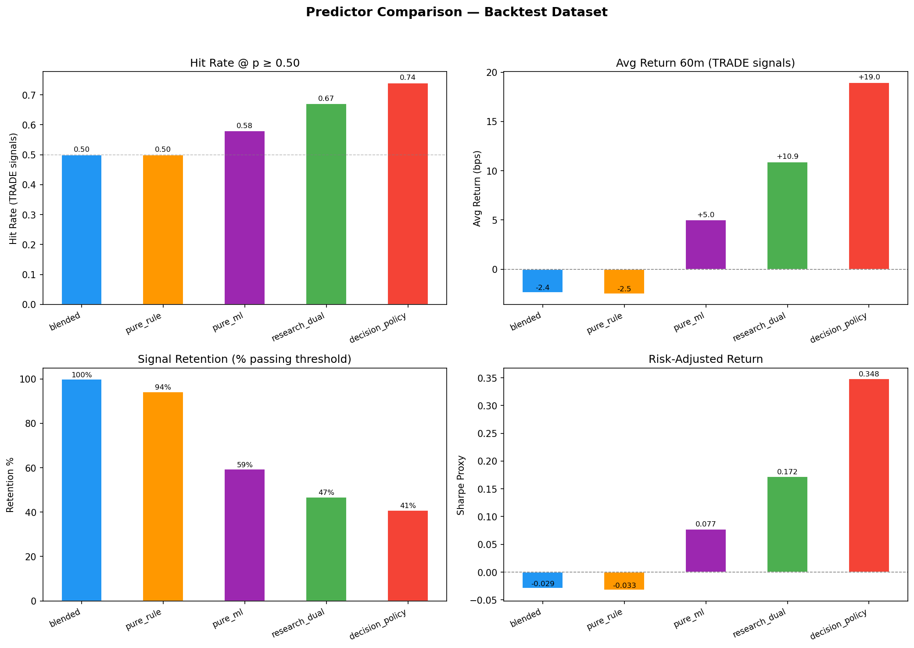
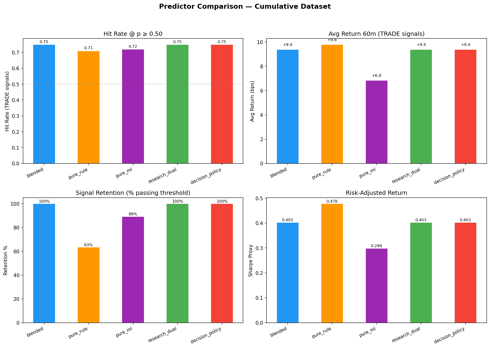
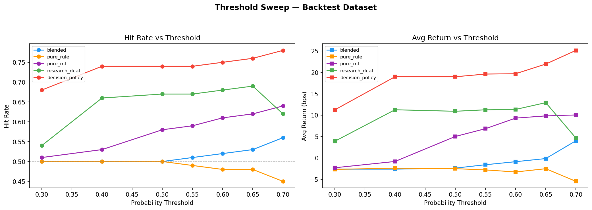
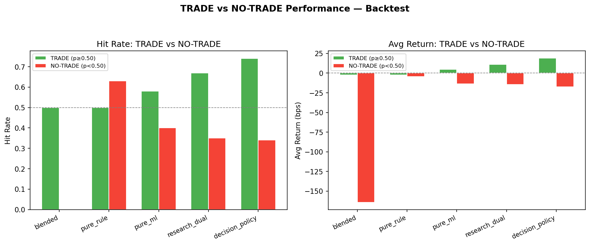
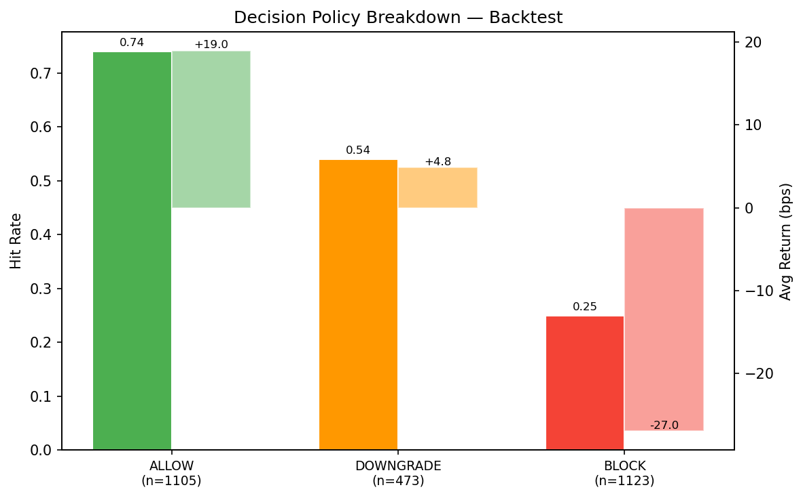
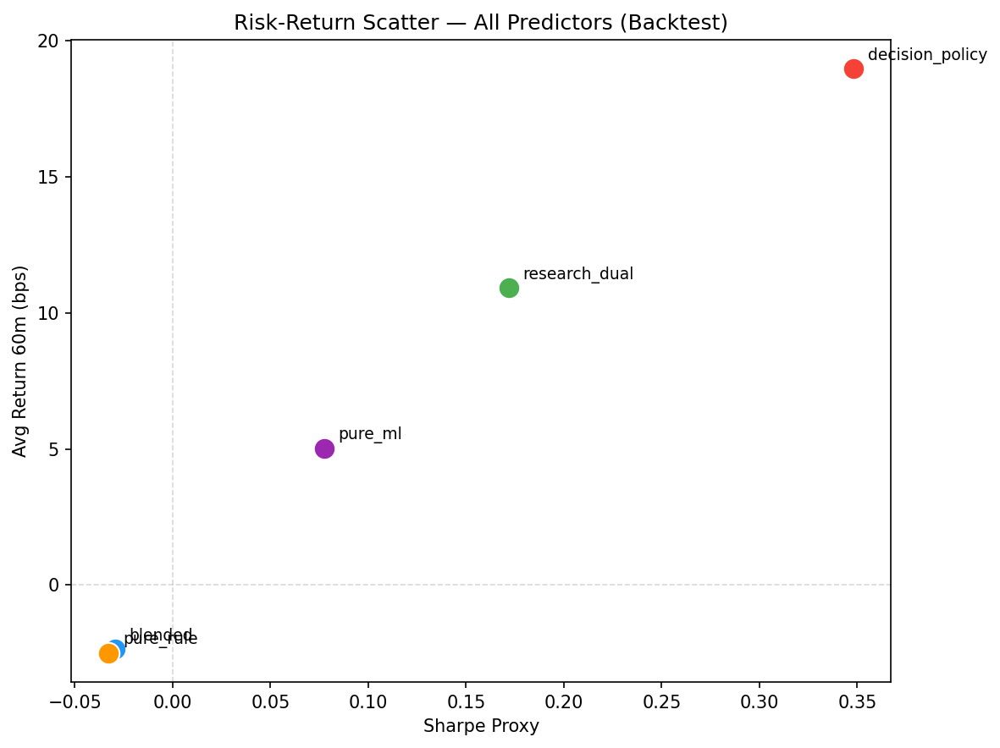

# Predictor Method Comparison Report

**Generated:** 2026-03-18T13:28:25.899289
**Author:** Pramit Dutta  |  **Organization:** Quant Engines

---

## 1. Datasets

| Dataset | Total Rows | With Outcomes | Date Range |
|---------|-----------|--------------|-----------|
| Cumulative | 279 | 93 | — |
| Backtest | 7,404 | 2,701 | 2016–2025 (10 years simulated) |

## 2. Predictor Methods

| Predictor | Probability Source | Description |
|-----------|-------------------|-------------|
| **blended** | `hybrid_move_probability` | 70/30 rule+ML blend (production) |
| **pure_rule** | `rule_move_probability` | Rule-based Bayesian prior only |
| **pure_ml** | `ml_move_probability` | ML model only |
| **research_dual** | `pred_research_dual` | GBT rank + LogReg calibration |
| **decision_policy** | `pred_decision_policy` | Dual-model + dual_threshold gate |

## 3. Performance — Backtest (7,404 signals)

Threshold: p ≥ 0.50 for TRADE signals

| Predictor | Evaluable | TRADE | Retention | Hit Rate | Avg Ret (bps) | Cum Ret (bps) | Max DD (bps) | Sharpe | Prob-Ret Corr |
|-----------|----------|-------|----------|----------|--------------|--------------|-------------|--------|--------------|
| **blended** | 2,701 | 2,697 | 99.85% | 0.5 | -2.36 | -6,365 | -15,067 | -0.0295 | 0.0906 |
| **pure_rule** | 2,701 | 2,546 | 94.26% | 0.5 | -2.49 | -6,333 | -13,767 | -0.0327 | -0.0257 |
| **pure_ml** | 2,701 | 1,603 | 59.35% | 0.58 | 5.03 | 8,058 | -3,217 | 0.0775 | 0.1149 |
| **research_dual** | 2,701 | 1,264 | 46.8% | 0.67 | 10.92 | 13,799 | -2,326 | 0.1719 | 0.2128 |
| **decision_policy** | 2,701 | 1,105 | 40.91% | 0.74 | 18.98 | 20,977 | -932 | 0.3482 | 0.236 |

### Filtering Effectiveness — Backtest (7,404 signals)

| Predictor | TRADE HR | TRADE Ret | NO-TRADE HR | NO-TRADE Ret | Separation |
|-----------|---------|----------|------------|-------------|-----------|
| blended | 0.5 | -2.4 | 0 | -164.2 | **+161.8 bps** |
| pure_rule | 0.5 | -2.5 | 0.63 | -4.5 | **+2.0 bps** |
| pure_ml | 0.58 | +5.0 | 0.4 | -13.7 | **+18.8 bps** |
| research_dual | 0.67 | +10.9 | 0.35 | -14.5 | **+25.4 bps** |
| decision_policy | 0.74 | +19.0 | 0.34 | -17.5 | **+36.5 bps** |

## 3. Performance — Cumulative (live signals)

Threshold: p ≥ 0.50 for TRADE signals

| Predictor | Evaluable | TRADE | Retention | Hit Rate | Avg Ret (bps) | Cum Ret (bps) | Max DD (bps) | Sharpe | Prob-Ret Corr |
|-----------|----------|-------|----------|----------|--------------|--------------|-------------|--------|--------------|
| **blended** | 93 | 93 | 100.0% | 0.75 | 9.38 | 873 | -380 | 0.4026 | -0.3245 |
| **pure_rule** | 93 | 59 | 63.44% | 0.71 | 9.8 | 578 | -240 | 0.4779 | 0.2948 |
| **pure_ml** | 93 | 83 | 89.25% | 0.72 | 6.84 | 568 | -440 | 0.299 | -0.3489 |
| **research_dual** | 93 | 93 | 100.0% | 0.75 | 9.38 | 873 | -380 | 0.4026 | -0.3479 |
| **decision_policy** | 93 | 93 | 100.0% | 0.75 | 9.38 | 873 | -380 | 0.4026 | -0.3479 |

### Filtering Effectiveness — Cumulative (live signals)

| Predictor | TRADE HR | TRADE Ret | NO-TRADE HR | NO-TRADE Ret | Separation |
|-----------|---------|----------|------------|-------------|-----------|
| blended | 0.75 | +9.4 | 0 | +0.0 | **+9.4 bps** |
| pure_rule | 0.71 | +9.8 | 0.82 | +8.7 | **+1.1 bps** |
| pure_ml | 0.72 | +6.8 | 1.0 | +30.5 | **-23.7 bps** |
| research_dual | 0.75 | +9.4 | 0 | +0.0 | **+9.4 bps** |
| decision_policy | 0.75 | +9.4 | 0 | +0.0 | **+9.4 bps** |

## 4. Decision Policy Breakdown — Backtest

| Decision | N | Hit Rate | Avg Return (bps) | Cum Return (bps) |
|----------|---|----------|-----------------|-----------------|
| ALLOW | 1105 | 0.74 | 18.98 | 20,977 |
| DOWNGRADE | 473 | 0.54 | 4.85 | 2,296 |
| BLOCK | 1123 | 0.25 | -26.98 | -30,295 |

## 4. Decision Policy Breakdown — Cumulative

| Decision | N | Hit Rate | Avg Return (bps) | Cum Return (bps) |
|----------|---|----------|-----------------|-----------------|
| ALLOW | 93 | 0.75 | 9.38 | 873 |

## 5. Threshold Sensitivity (Backtest)

### blended

| Threshold | N Trade | Retention | Hit Rate | Avg Return | Sharpe |
|-----------|---------|----------|----------|-----------|--------|
| 0.30 | 2,701 | 100.0% | 0.5 | -2.6 | -0.0323 |
| 0.40 | 2,701 | 100.0% | 0.5 | -2.6 | -0.0323 |
| 0.50 | 2,697 | 99.85% | 0.5 | -2.36 | -0.0295 |
| 0.55 | 2,681 | 99.26% | 0.51 | -1.57 | -0.0205 |
| 0.60 | 2,393 | 88.6% | 0.52 | -0.86 | -0.0115 |
| 0.65 | 2,089 | 77.34% | 0.53 | -0.13 | -0.0018 |
| 0.70 | 1,596 | 59.09% | 0.56 | 4.03 | 0.062 |

### pure_rule

| Threshold | N Trade | Retention | Hit Rate | Avg Return | Sharpe |
|-----------|---------|----------|----------|-----------|--------|
| 0.30 | 2,700 | 99.96% | 0.5 | -2.65 | -0.0329 |
| 0.40 | 2,688 | 99.52% | 0.5 | -2.38 | -0.0298 |
| 0.50 | 2,546 | 94.26% | 0.5 | -2.49 | -0.0327 |
| 0.55 | 2,428 | 89.89% | 0.49 | -2.78 | -0.0363 |
| 0.60 | 2,184 | 80.86% | 0.48 | -3.26 | -0.0427 |
| 0.65 | 1,739 | 64.38% | 0.48 | -2.5 | -0.0324 |
| 0.70 | 1,335 | 49.43% | 0.45 | -5.45 | -0.0679 |

### pure_ml

| Threshold | N Trade | Retention | Hit Rate | Avg Return | Sharpe |
|-----------|---------|----------|----------|-----------|--------|
| 0.30 | 2,614 | 96.78% | 0.51 | -2.28 | -0.029 |
| 0.40 | 2,178 | 80.64% | 0.53 | -0.81 | -0.0104 |
| 0.50 | 1,603 | 59.35% | 0.58 | 5.03 | 0.0775 |
| 0.55 | 1,471 | 54.46% | 0.59 | 6.85 | 0.1063 |
| 0.60 | 963 | 35.65% | 0.61 | 9.32 | 0.1347 |
| 0.65 | 899 | 33.28% | 0.62 | 9.84 | 0.1498 |
| 0.70 | 362 | 13.4% | 0.64 | 10.06 | 0.1554 |

### research_dual

| Threshold | N Trade | Retention | Hit Rate | Avg Return | Sharpe |
|-----------|---------|----------|----------|-----------|--------|
| 0.30 | 2,346 | 86.86% | 0.54 | 3.9 | 0.0619 |
| 0.40 | 1,407 | 52.09% | 0.66 | 11.27 | 0.1751 |
| 0.50 | 1,264 | 46.8% | 0.67 | 10.92 | 0.1719 |
| 0.55 | 1,240 | 45.91% | 0.67 | 11.26 | 0.194 |
| 0.60 | 1,178 | 43.61% | 0.68 | 11.35 | 0.1975 |
| 0.65 | 938 | 34.73% | 0.69 | 12.93 | 0.228 |
| 0.70 | 291 | 10.77% | 0.62 | 4.66 | 0.072 |

### decision_policy

| Threshold | N Trade | Retention | Hit Rate | Avg Return | Sharpe |
|-----------|---------|----------|----------|-----------|--------|
| 0.30 | 1,256 | 46.5% | 0.68 | 11.24 | 0.1781 |
| 0.40 | 1,105 | 40.91% | 0.74 | 18.98 | 0.3482 |
| 0.50 | 1,105 | 40.91% | 0.74 | 18.98 | 0.3482 |
| 0.55 | 1,084 | 40.13% | 0.74 | 19.61 | 0.4197 |
| 0.60 | 1,027 | 38.02% | 0.75 | 19.69 | 0.4292 |
| 0.65 | 810 | 29.99% | 0.76 | 21.95 | 0.499 |
| 0.70 | 211 | 7.81% | 0.78 | 25.14 | 0.58 |

## 6. Rankings (Backtest @ p ≥ 0.50)

| Metric | #1 | #2 | #3 | #4 | #5 |
|--------|----|----|----|----|-----|
| Hit Rate | decision_policy| research_dual| pure_ml| blended| pure_rule |
| Avg Return | decision_policy| research_dual| pure_ml| blended| pure_rule |
| Sharpe | decision_policy| research_dual| pure_ml| blended| pure_rule |
| Cum Return | decision_policy| research_dual| pure_ml| pure_rule| blended |

## 7. Charts

