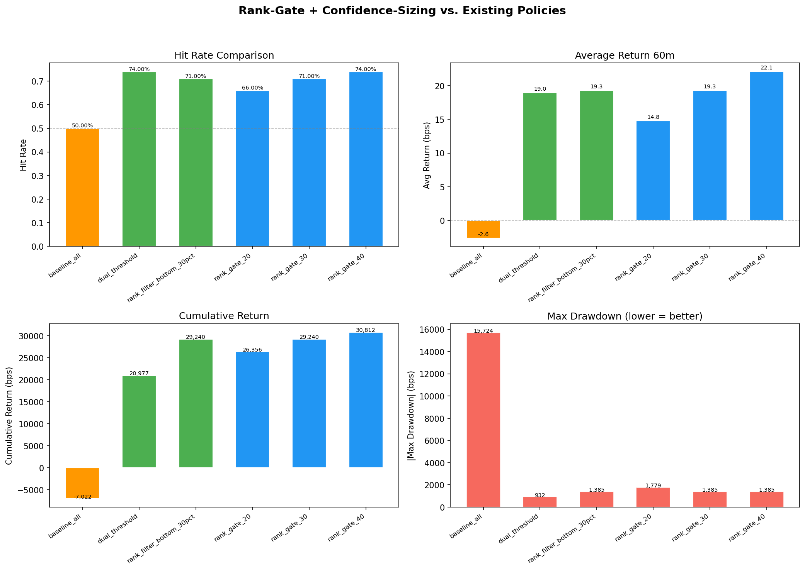
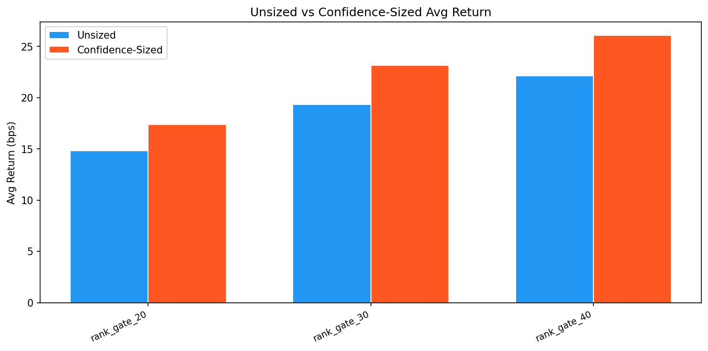
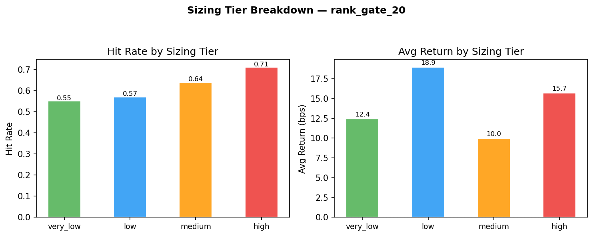
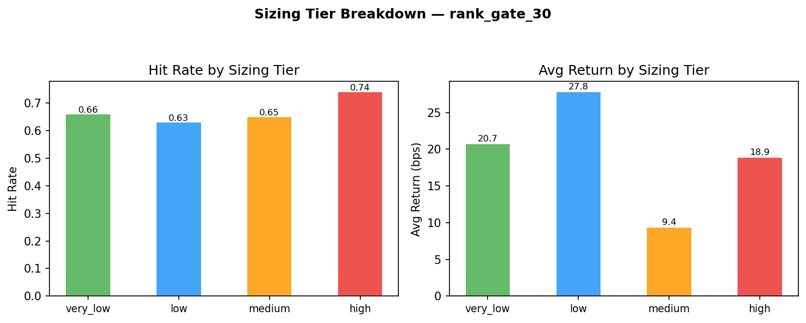
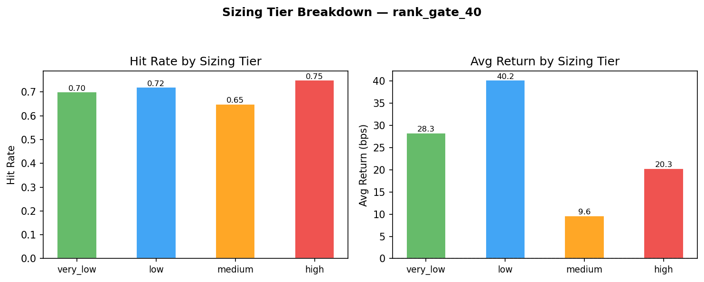
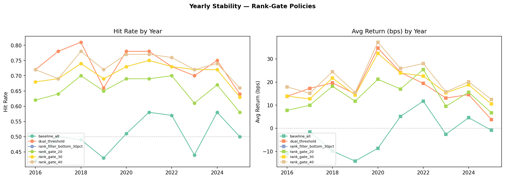
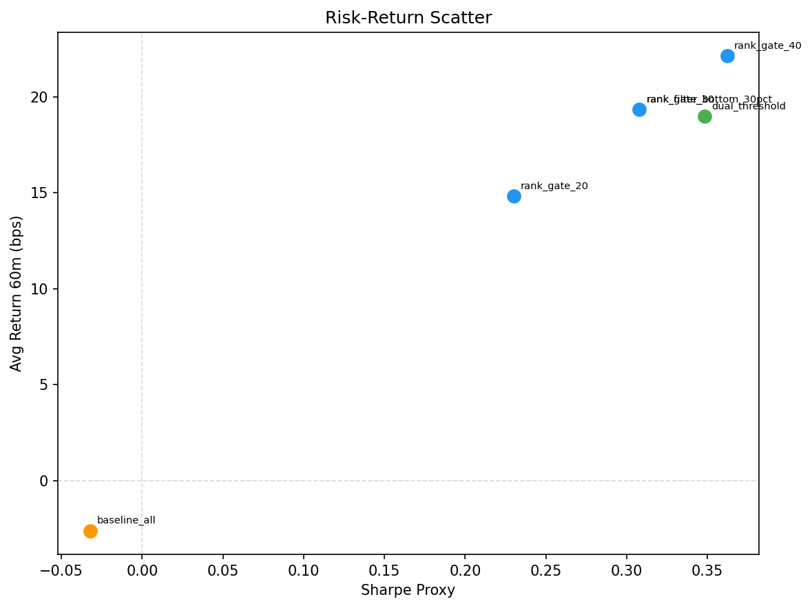

# Rank-Gate + Confidence-Sizing Policy Evaluation

**Generated:** 2026-03-18T13:10:13.844547
**Author:** Pramit Dutta  |  **Organization:** Quant Engines

> **Thesis:** Remove confidence as a filtering gate. Use rank (GBT) as the sole quality filter. Repurpose confidence (LogReg) exclusively for position sizing — allocating more capital to higher-conviction signals.

---

## 1. Design

### Rank-Gate (filtering)
| Percentile | Logic |
|------------|-------|
| 20% | Block signals with rank score below the 20th percentile |
| 30% | Block signals with rank score below the 30th percentile |
| 40% | Block signals with rank score below the 40th percentile |

### Confidence-Sizing (position sizing only)
| Tier | Confidence Range | Size Multiplier |
|------|-----------------|-----------------|
| very_low | 0.00–0.40 | 0.5× |
| low | 0.40–0.50 | 0.5× |
| medium | 0.50–0.60 | 1.0× |
| high | 0.60–1.01 | 1.5× |

## 2. Performance Comparison

| Policy | N | Ret% | Hit Rate | Avg Ret (bps) | Cum Ret (bps) | Max DD (bps) | Sharpe | Sized Avg Ret | Sized Cum Ret | Sized DD | Sizing Δ% |
|--------|---|------|----------|--------------|--------------|-------------|--------|--------------|--------------|---------|-----------|
| baseline_all | 7,404 | 100.0 | 0.5 | -2.6 | -7,022 | -15723.51 | -0.0323 | — | — | — | — |
| dual_threshold | 3,603 | 48.66 | 0.74 | 18.98 | 20,977 | -931.94 | 0.3482 | — | — | — | — |
| rank_filter_bottom_30pct | 5,183 | 70.0 | 0.71 | 19.34 | 29,240 | -1385.47 | 0.3079 | — | — | — | — |
| rank_gate_20 | 5,925 | 80.02 | 0.66 | 14.81 | 26,356 | -1779.2 | 0.23 | 17.38 | 30922.84 | -2030.18 | 17.33 |
| rank_gate_30 | 5,183 | 70.0 | 0.71 | 19.34 | 29,240 | -1385.47 | 0.3079 | 23.16 | 35019.8 | -1167.43 | 19.77 |
| rank_gate_40 | 4,442 | 59.99 | 0.74 | 22.13 | 30,812 | -1385.47 | 0.3622 | 26.08 | 36304.12 | -1167.43 | 17.83 |

## 3. Sizing Tier Breakdown

### rank_gate_20

| Tier | Multiplier | N | Hit Rate | Avg Return (bps) |
|------|-----------|---|----------|-----------------|
| very_low | 0.5× | 841 | 0.55 | 12.44 |
| low | 0.5× | 1185 | 0.57 | 18.94 |
| medium | 1.0× | 1769 | 0.64 | 9.97 |
| high | 1.5× | 2130 | 0.71 | 15.7 |

### rank_gate_30

| Tier | Multiplier | N | Hit Rate | Avg Return (bps) |
|------|-----------|---|----------|-----------------|
| very_low | 0.5× | 461 | 0.66 | 20.73 |
| low | 0.5× | 980 | 0.63 | 27.82 |
| medium | 1.0× | 1719 | 0.65 | 9.4 |
| high | 1.5× | 2023 | 0.74 | 18.93 |

### rank_gate_40

| Tier | Multiplier | N | Hit Rate | Avg Return (bps) |
|------|-----------|---|----------|-----------------|
| very_low | 0.5× | 333 | 0.7 | 28.33 |
| low | 0.5× | 638 | 0.72 | 40.19 |
| medium | 1.0× | 1523 | 0.65 | 9.64 |
| high | 1.5× | 1948 | 0.75 | 20.32 |

## 4. Yearly Stability

| Year | Policy | N | Hit Rate | Avg Return (bps) |
|------|--------|---|----------|-----------------|
| 2016 | baseline_all | 738 | 0.42 | -10.98 |
| 2016 | dual_threshold | 318 | 0.72 | 13.83 |
| 2016 | rank_filter_bottom_30pct | 452 | 0.68 | 13.89 |
| 2016 | rank_gate_20 | 514 | 0.62 | 7.76 |
| 2016 | rank_gate_30 | 452 | 0.68 | 13.89 |
| 2016 | rank_gate_40 | 387 | 0.72 | 17.91 |
| 2017 | baseline_all | 744 | 0.5 | -1.52 |
| 2017 | dual_threshold | 392 | 0.78 | 17.26 |
| 2017 | rank_filter_bottom_30pct | 554 | 0.69 | 12.72 |
| 2017 | rank_gate_20 | 616 | 0.64 | 9.95 |
| 2017 | rank_gate_30 | 554 | 0.69 | 12.72 |
| 2017 | rank_gate_40 | 482 | 0.69 | 15.14 |
| 2018 | baseline_all | 738 | 0.49 | -9.84 |
| 2018 | dual_threshold | 345 | 0.81 | 19.65 |
| 2018 | rank_filter_bottom_30pct | 510 | 0.74 | 21.75 |
| 2018 | rank_gate_20 | 582 | 0.7 | 18.17 |
| 2018 | rank_gate_30 | 510 | 0.74 | 21.75 |
| 2018 | rank_gate_40 | 448 | 0.78 | 24.46 |
| 2019 | baseline_all | 732 | 0.43 | -14.2 |
| 2019 | dual_threshold | 327 | 0.66 | 14.88 |
| 2019 | rank_filter_bottom_30pct | 496 | 0.69 | 14.41 |
| 2019 | rank_gate_20 | 570 | 0.65 | 11.72 |
| 2019 | rank_gate_30 | 496 | 0.69 | 14.41 |
| 2019 | rank_gate_40 | 416 | 0.72 | 15.5 |
| 2020 | baseline_all | 750 | 0.51 | -8.66 |
| 2020 | dual_threshold | 391 | 0.78 | 34.75 |
| 2020 | rank_filter_bottom_30pct | 554 | 0.73 | 32.42 |
| 2020 | rank_gate_20 | 618 | 0.69 | 21.18 |
| 2020 | rank_gate_30 | 554 | 0.73 | 32.42 |
| 2020 | rank_gate_40 | 469 | 0.77 | 37.25 |
| 2021 | baseline_all | 741 | 0.58 | 5.16 |
| 2021 | dual_threshold | 430 | 0.78 | 24.14 |
| 2021 | rank_filter_bottom_30pct | 569 | 0.75 | 23.9 |
| 2021 | rank_gate_20 | 631 | 0.69 | 16.98 |
| 2021 | rank_gate_30 | 569 | 0.75 | 23.9 |
| 2021 | rank_gate_40 | 510 | 0.77 | 25.87 |
| 2022 | baseline_all | 744 | 0.57 | 11.73 |
| 2022 | dual_threshold | 411 | 0.73 | 19.42 |
| 2022 | rank_filter_bottom_30pct | 561 | 0.73 | 22.62 |
| 2022 | rank_gate_20 | 644 | 0.7 | 25.43 |
| 2022 | rank_gate_30 | 561 | 0.73 | 22.62 |
| 2022 | rank_gate_40 | 491 | 0.76 | 28.03 |
| 2023 | baseline_all | 735 | 0.44 | -2.59 |
| 2023 | dual_threshold | 371 | 0.7 | 13.08 |
| 2023 | rank_filter_bottom_30pct | 524 | 0.72 | 15.33 |
| 2023 | rank_gate_20 | 618 | 0.61 | 9.51 |
| 2023 | rank_gate_30 | 524 | 0.72 | 15.33 |
| 2023 | rank_gate_40 | 448 | 0.72 | 15.77 |
| 2024 | baseline_all | 738 | 0.58 | 4.57 |
| 2024 | dual_threshold | 328 | 0.75 | 14.54 |
| 2024 | rank_filter_bottom_30pct | 486 | 0.72 | 18.81 |
| 2024 | rank_gate_20 | 560 | 0.67 | 15.59 |
| 2024 | rank_gate_30 | 486 | 0.72 | 18.81 |
| 2024 | rank_gate_40 | 418 | 0.74 | 20.1 |
| 2025 | baseline_all | 744 | 0.5 | -0.85 |
| 2025 | dual_threshold | 290 | 0.64 | 3.8 |
| 2025 | rank_filter_bottom_30pct | 477 | 0.63 | 10.53 |
| 2025 | rank_gate_20 | 572 | 0.58 | 6.68 |
| 2025 | rank_gate_30 | 477 | 0.63 | 10.53 |
| 2025 | rank_gate_40 | 373 | 0.66 | 12.48 |

## 5. Verdict

**Best unsized policy:** rank_gate_40
**Best sized policy:** rank_gate_40

**Does rank-gate + confidence-sizing improve returns without increasing drawdown?**

**Best rank-gate policy: rank_gate_40** — HR 0.74, avg return 22.1 bps, max DD -1385.47 bps, Sharpe 0.3622
**Best existing policy: rank_filter_bottom_30pct** — HR 0.71, avg return 19.3 bps, max DD -1385.47 bps, Sharpe 0.3079

✅ **YES** — The rank-gate policy improves average return without increasing drawdown.

**Confidence-sizing impact (rank_gate_40):** sized avg 26.1 bps vs unsized 22.1 bps (Δ = +3.9 bps, +17.8% improvement)

## 6. Charts

